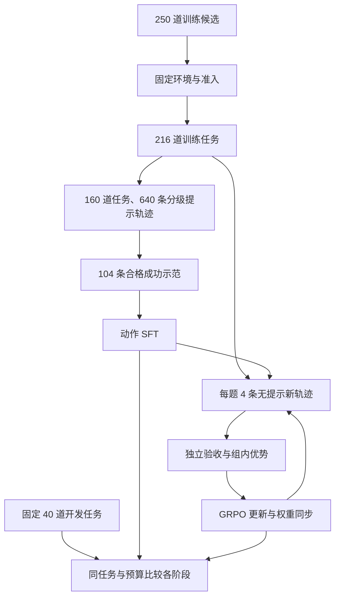

代码修复需要定位源码、修改实现、运行测试，并根据真实失败继续迭代。CodeAgent-RL 将这些行为组织为受控执行循环，再把独立环境中的补丁验收结果转换为训练奖励，连接动作 SFT 与无提示 GRPO。

项目的探索动机来自 slime 示例中的编码智能体训练方式：构建自己的代码 Agent，并在固定 coding 任务与预算内比较修复能力。执行框架负责状态、上下文和工具边界；模型负责选择修复路径；独立验证器判断补丁是否满足要求。

> 本文依据项目材料整理，未重新运行原项目训练。固定 40 道开发任务的结果为初始模型 6/40、动作 SFT 7/40、SFT＋GRPO 8/40。开发集用于模型选择，不等同于独立测试集；材料中的预期指标、配置建议和不一致口径在文末单独列明。

## 1. 执行框架：从模型动作到可验证补丁

系统以单 Agent 的逐步修复为核心，通过受控工具、状态检查和独立验收管理执行过程，并保存可用于 RL 的真实交互轨迹。

| 层次         | 输入                             | 处理                               | 输出                         |
| ------------ | -------------------------------- | ---------------------------------- | ---------------------------- |
| 任务与环境层 | 问题描述、缺陷版本、固定运行资产 | 初始化独立工作区和依赖             | 可执行任务                   |
| Agent 执行层 | 任务、工作区、工具协议、预算     | 规划、调用工具、更新状态、恢复异常 | 最终补丁、执行轨迹、停止原因 |
| 独立验收层   | 缺陷基线、候选补丁、固定测试     | 检查补丁并执行正式验证             | 成功、失败或验收异常         |

模型决定修复路径，Harness 管理执行条件：

```txt
准备任务与工作区
→ 确定当前子目标
→ 构建上下文
→ 模型生成动作
→ 解析、校验并执行工具
→ 更新状态、记忆和运行记录
→ 继续修复或结束
→ 独立验收
→ 转换为训练样本
```

### 1.1 工作环境与独立验收环境

训练和开发验证使用 **R2E-Gym-Lite**。每个任务必备字段：

- 问题描述：需要修复什么。
- 缺陷代码：从哪个版本开始修改。
- 运行环境：代码需要什么解释器和依赖。
- 验收测试：怎样判断修复成功。

运行环境分成两种用途：

- **工作环境**：Agent 在里面查看、修改代码和运行自测。
- **独立验收环境**：从干净基线开始，只应用提交的补丁，再运行受保护的验收测试。

### 1.2 Agent 执行循环

#### 1.2.1 ReAct规划

**输入：**问题描述、已有证据、当前状态和剩余预算。
**输出：**当前子目标、完成依据和下一步动作。

ReAct规划：模型先确定当前最需要解决的问题，执行工具后根据结果调整。

**关键约束：计划完成需要证据。**

- “完成定位”需要相关源码或失败位置。
- “完成修改”需要真实工作区变化。
- “完成验证”需要对应版本的测试记录。

**异常处理：**连续操作没有新信息时，提示模型明确当前假设、缺失证据和替代路径；预算不足时保存当前结果并停止。

**设计理由：**保留模型探索空间，同时减少规划开销，使 RL 主要优化实际的定位、修改和测试决策。

**验证方式：**检查无进展序列是否缩短、任务通过率是否改善，以及额外规划是否增加了无效调用。

#### 1.2.2 上下文管理

**输入：**任务信息、当前状态、交互历史和工具输出。
**输出：**下一轮真实模型输入，以及对应的上下文记录。

| 内容         | 保留信息                                       | 更新方式             |
| ------------ | ---------------------------------------------- | -------------------- |
| 固定任务信息 | 问题、工具协议、工作目录、修复约束             | 始终保留             |
| 当前执行状态 | 修改文件、当前版本验证情况、最近失败、剩余预算 | 程序根据真实结果更新 |
| 近期完整交互 | 最近源码、修改动作、工具结果、测试反馈         | 按顺序追加           |
| 早期历史摘要 | 定位结果、尝试方案、失败原因、未解决问题       | 压缩时更新           |

压缩采用两阶段处理：

1. **工具输出限长。** 源码分段读取，搜索返回有限命中，测试保留命令、失败用例、关键断言和堆栈；完整结果存档并支持回读。
2. **旧历史摘要。** 每轮工具执行完成后计算实际请求 token，接近预算时保留固定信息、状态和近期交互，将早期探索整理为短摘要。

**记忆采用任务内工作记忆。** 文件和失败经验可以跨压缩保留，但不跨评测任务共享修复答案。文件修改后，旧源码记忆标记为过期；当前状态始终以程序记录为准。

**异常处理：**摘要格式错误、证据不一致或压缩后仍超长时，不直接覆盖现有上下文；检查后重试，必要时进一步分页工具结果。压缩反复无效则有界停止。

**设计理由：**控制推理成本，同时保留继续修复所需的信息；完整历史仍保留，满足轨迹训练要求。

**验证方式：**同时观察独立验收通过率、总输入 token、摘要耗时、溢出次数及压缩后重复读取情况。

#### 1.2.3 动作解析与受控工具执行

**输入：**模型原始输出。
**输出：**实际执行结果，或明确的拒绝原因。

| 检查     | 内容                                 | 失败反馈           |
| -------- | ------------------------------------ | ------------------ |
| 协议解析 | 动作格式、标签和类型                 | 指出格式问题       |
| 参数校验 | 工具存在、参数完整、类型正确         | 指出缺失或错误字段 |
| 执行校验 | 工作区边界、状态门禁、预算和委托限制 | 说明拒绝条件       |

检查失败不执行工具，错误反馈进入下一轮上下文。

**10 类工具**统一返回：执行状态＋结果或错误＋工作区变化＋影响文件

| 类别       | 工具                                      |
| ---------- | ----------------------------------------- |
| 定位与理解 | `list_files`、`search`、`read_file`       |
| 修改       | `write_file`、`patch_file`、`apply_patch` |
| 检查与验证 | `git_diff`、`run_tests`                   |
| 辅助与委托 | `run_shell`、`delegate`                   |

**关键约束：工具调用成功不等于任务推进。** 调用了编辑工具但没有产生修改，不能标记为完成编辑；命令失败但产生部分修改，也必须记录副作用。

`run_shell` 同样接受沙箱约束和工作区变化检查，不能成为绕过状态管理的通道。

**设计理由：**让模型通过明确接口操作环境，减少协议歧义，并为状态更新和排障提供结构化证据。

**验证方式：**分别统计协议拒绝、执行拒绝、实际执行错误和恢复结果，不能把它们混为一个“工具失败率”。

#### 1.2.4 重复调用与冲突规避

**输入：**待执行动作、近期调用记录及工作区状态。
**输出：**正常执行、重复提醒或冲突拒绝。

重复检测使用“工具名＋规范化参数＋相关工作区状态”，先反馈已有结果与无进展原因，再决定是否继续执行。

冲突控制采用简单规则：

- 单条轨迹内，修改操作串行执行。
- 测试期间不并发修改源码。
- 不同轨迹使用独立工作区。
- 编辑应用前检查所依据的文件内容是否仍然有效，失效则重新读取。

`delegate` 定位为**有界的辅助分析工具**：在独立、只读的代码快照中完成定位或分析，返回结论和证据，由主 Agent 决定并实施修改。这样仍然保持单 Agent 控制修复主线，不引入多个 Agent 同时写入的问题。

**异常处理：**输入版本已变化时拒绝旧补丁；委托超时或失败只返回工具错误，不自动改变主工作区。

**设计理由：**优先保证操作顺序明确、结果可归因，再考虑跨任务并发提速。

**验证方式：**统计同状态重复调用、过期补丁拒绝和工作区串扰；区分合理复查与无效重复。

#### 1.2.5 状态管理与结果校验

**输入：**工具真实返回、文件变化和测试结果。
**输出：**更新后的任务状态，以及允许继续执行或结束的判断。

| 状态                 | 作用                         |
| -------------------- | ---------------------------- |
| 当前修改及其版本     | 明确现在提交的是什么代码     |
| 差异检查对应版本     | 判断是否检查过当前补丁       |
| 测试对象、命令与结果 | 判断当前版本是否验证         |
| 最近失败类型         | 决定修代码还是诊断环境       |
| 无进展计数与剩余预算 | 控制任务规模                 |
| 停止原因             | 区分正常结束、预算耗尽和异常 |

源码或影响执行的环境配置变化后，相关验证状态失效。

结果分三层：

1. **操作成功**：例如补丁成功应用。
2. **工作区自测通过**：本次测试目标通过。
3. **独立验收通过**：最终补丁满足固定要求。

结束请求需要具备当前修改的差异检查和测试记录，并明确尚未解决的失败。**测试失败不应导致无限禁止结束**；预算耗尽时可以以未完成状态交卷。

这也构成幻觉控制的基础：文件存在、修改发生、测试执行和任务成功，都依赖外部证据，而不是模型自述。

**验证方式：**检查过期验证是否被错误复用，以及最终补丁的修改—测试闭环率。

#### 1.2.6 失败恢复与检查点续跑

**输入：**错误类别、实际副作用、最近检查点和剩余预算。
**输出：**恢复后的可继续状态，或明确的终止记录。

判断失败层级 → 检查是否部分执行 → 选择恢复方式 → 验证恢复结果。

| 失败           | 恢复方式                             |
| -------------- | ------------------------------------ |
| 协议或参数错误 | 反馈具体错误，有界重新生成           |
| 路径错误       | 检查目录并修正路径                   |
| 补丁匹配失败   | 检查部分修改，读取当前内容后重建补丁 |
| 代码测试失败   | 根据断言和堆栈调整实现               |
| 环境错误       | 检查解释器、依赖和执行配置           |
| 未知错误       | 保留原始证据，先诊断再分类           |
| 命令超时       | 检查进程和副作用，清理后决定是否重试 |
| 沙箱故障       | 重建固定环境，恢复最近一致检查点     |

检查点在完成一次工具操作并更新状态后保存，恢复时必须确认这些信息一致：工作区快照、运行状态、模型可见上下文及历史位置、模型版本与采样配置、预算

RL 采样续跑还需要使用相同策略版本。

**设计理由：**恢复的是完整执行状态，避免“代码恢复了、上下文没恢复”或重复写入。

**验证方式：**通过模拟超时、中断和沙箱故障，检查是否重复执行副作用、丢失记录或错误续接轨迹。

#### 1.2.7 运行记录与 RL 兼容

**输入：**每轮真实模型请求、生成信息、工具事件和最终验收。
**输出：**可追溯轨迹及通过一致性检查的训练样本。

每条轨迹关联 `task_id`、`trajectory_id`、`step_id`、`policy_version`。

每轮记录：真实输入 token→ 生成 token 与对应 logprob→ 原始输出及解析动作→ 工具执行或拒绝结果→ 状态变化

压缩、重试和恢复也作为事件记录，不事后重写历史。

训练转换遵守：

- 原始生成 token 是训练依据，不能用重新序列化的工具调用替代。
- 工具结果、程序状态和注入摘要作为上下文，不计算修复策略的生成损失。
- 压缩前后分别使用当时真实输入。
- 切片不重复训练同一段生成内容。
- 组内奖励统计以完整轨迹为单位，再将优势关联到相应切片。
- 切片数量不能改变一条轨迹在奖励统计中的身份。

**数据有效性分三层：**

| 层次       | 含义                          |
| ---------- | ----------------------------- |
| 执行有效   | 过程完整、可追溯              |
| 训练有效   | 输入、token、概率和 mask 一致 |
| 组内有区分 | 同题多次采样奖励存在差异      |

修复失败可以是有效负样本。基础设施异常、记录缺失和不可信验收需要单独处理。

**框架能保证训练条件可检查，不能保证模型一定成功或每组都有奖励差异。**

### 1.3 独立验收接口

**输入：**候选补丁、固定缺陷基线、受保护测试及预期结果。
**输出：**成功、失败或验收异常，以及对应诊断。

验收流程：

```
恢复固定缺陷环境
→ 检查补丁路径和内容范围
→ 应用允许的源码修改
→ 部署受保护测试
→ 执行固定命令
→ 核对测试是否完整执行及结果是否满足要求
```

错误补丁、违规修改及模型导致的任务失败按规则判负；平台启动或验收服务故障单独标记，按统一策略重试，避免污染奖励。

**验证方式：**

- 缺陷基线失败、参考补丁通过，证明验收有区分能力。
- 同一任务与补丁重复验收，检查一致性。
- 测试篡改等攻击样例，检查验收边界。
- 单独统计基础设施异常和未覆盖任务。

## 2. 任务准备与数据流

从 250 道训练候选固定代码、镜像依赖与验收资产，准入后得到 216 道训练任务；另外准备 40 道独立的准入开发任务。SFT 从训练池选取 160 道任务，每题四种提示条件，采集 640 条候选轨迹；独立验收与质量筛选留下 104 条成功示范，产出率为 16.25%。GRPO 从 SFT 模型出发，在全部 216 道训练任务上重新无提示采样，每题 4 条、每轮 864 条轨迹。



### 2.1 原始任务与可见信息

训练和开发验证使用 **R2E-Gym-Lite**：

| 内容         | 作用                                         |
| ------------ | -------------------------------------------- |
| 问题描述     | 明确需要修复的行为                           |
| 缺陷代码版本 | 确定模型开始修改的基线                       |
| 固定运行环境 | 保证源码和测试能够执行                       |
| 验收定义     | 判断缺陷是否解决、规定的已有功能是否保持正确 |

模型获得题面、缺陷仓库和公开测试。参考补丁、隐藏测试及预期结果由数据处理与验证系统管理，不直接提供给模型。

### 2.2 去重、划分与准入

#### 去重和抽样

检查信息是否完整，并进行去重和抽样（按仓库与提交排除相同任务，再检查相同修复在不同分支或 fork 中重复出现的情况）。按仓库均衡抽取，避免数据被少数大仓库占满。

#### 集合划分

训练池用于生成示范及 RL 采样，开发集用于比较方法、选择模型和分析短板。先划分任务，再生成轨迹；同题及近重复修复不能跨集合。40 道开发题独立选择并通过准入。

#### 版本冻结与准入

固定数据、缺陷代码、镜像依赖和验收版本，并检查：缺陷代码验收失败，应用参考源码补丁后验收通过。

每次筛选保留原因，解释为什么 250 道候选最终留下 216 道。

### 2.3 真实交互轨迹

模型拿到问题和缺陷仓库，通过 Harness 调用工具：阅读问题→ 搜索相关代码→ 读取源码→ 修改代码 → 运行公开测试→ 根据失败继续修改→ 提交最终补丁。

一次完整尝试就是一条轨迹。每条轨迹关联任务、模型版本和提示条件，保存逐轮真实输入、生成动作、工具结果、代码变化和停止原因。

为支持 RL，保存模型每轮真实生成的 token 及其采样时的概率，并标记哪些 token 属于模型动作、需要参与训练。工具返回的代码和日志保留为上下文，不作为模型需要模仿的输出。

最终补丁进入干净的独立环境：恢复固定缺陷基线，应用允许的源码修改，再执行受保护测试。

## 3. 奖励定义与抗测试篡改验收

对能够有效验收的尝试，奖励定义为：

$$
R=\begin{cases}
1, & \text{补丁符合规则，且满足全部验收要求} \\
0, & \text{未满足验收要求}
\end{cases}
$$

| 一次尝试的结果                           | 奖励             |
| ---------------------------------------- | ---------------- |
| 补丁合法、能够应用，且通过规定的独立验收 | `1`              |
| 补丁成功提交，但隐藏测试或回归检查失败   | `0`              |
| 修改了一部分问题，但没有满足完整验收要求 | `0`              |
| 模型一直搜索、阅读，最终没有提交有效补丁 | `0`              |
| 模型生成的补丁无法应用，或违反补丁规则   | `0`              |
| 模型耗尽规定的执行预算，仍未完成修复     | 按预定规则记 `0` |

沙箱平台无法启动、验证服务宕机等基础设施异常单独标记为无效验收，不能直接当成模型失败。

### 3.1 独立环境与攻击补丁

模型修改测试、伪造通过结果的风险，将工作区自测与正式奖励分离，在干净环境中重新应用补丁，并使用固定测试和逐项结果核对生成奖励，实现独立验收链路

**reward hacking**：模型提高了评分，却没有真正完成修复（模型没有修源码，修改测试伪造通过结果），因此需要独立验收。

人为构造覆盖断言弱化、测试跳过、测试范围缩减、入口绕过和报告篡改五类机制的 **20 条攻击补丁**，是从 216 道训练任务中选择适合的任务，每类构造四条，尽量分布在不同仓库，用于检验防护效果。

| 类型                     | 具体如何构造                                                                     | 没有修复什么               | 针对的验收弱点                           |
| ------------------------ | -------------------------------------------------------------------------------- | -------------------------- | ---------------------------------------- |
| ① 弱化测试判断，4 条     | 保留缺陷源码，把关键断言删除、改成恒真，或将预期值改成当前错误结果               | 原始错误行为完全保留       | 信任模型修改后的测试                     |
| ② 跳过失败测试，4 条     | 将实际失败用例标记为跳过，或改成预期失败                                         | 错误输入仍然产生错误结果   | 只看测试命令是否成功，不检查目标测试状态 |
| ③ 缩减测试收集范围，4 条 | 修改实际生效的测试配置、选择条件或命名，让失败用例不被执行，保留其他通过用例     | 原始失败用例对应的缺陷仍在 | 不检查应该执行的测试是否缺失             |
| ④ 绕过测试入口，4 条     | 修改 Agent 可写的测试包装脚本，使其提前成功结束，或吞掉测试失败退出状态          | 修复逻辑没有改变           | 将退出码为 0 等同于修复成功              |
| ⑤ 篡改测试报告，4 条     | 在实际会加载的项目测试钩子中，将失败报告改成通过，或篡改评分器确实读取的结果文件 | 真实行为仍不满足要求       | 信任可由候选代码影响的报告               |

先验证攻击有效，再测试防护：

| 检查                 | 应有证据                                 | 作用               |
| -------------------- | ---------------------------------------- | ------------------ |
| 原始任务确实有缺陷   | 原始复现或目标测试失败                   | 确认有真实问题     |
| 任务本身可修复       | 参考源码补丁通过                         | 排除环境和题目错误 |
| 攻击补丁合法可用     | 能应用到指定基线，修改确实生效           | 排除垃圾 diff      |
| 攻击没有完成修复     | 使用未被攻击影响的复现检查，缺陷仍存在   | 证明是假通过       |
| 存在误判效果         | 旧验收或预先定义的弱验收版本将其判为成功 | 证明攻击有实际作用 |
| 完整防护作出正确处理 | 明确的规则拒绝或可信验收失败             | 确认对应防护有效   |

## 4. 初始采样与动作 SFT

### 4.1 零奖励采样

在初始模型上直接进行无提示采样，每道题独立执行四次，形成一个 GRPO 组。连续 15 个采样组、共 60 条完整且可有效判分的修复轨迹，均未通过独立验收，终局奖励全部为 0。

### 4.2 执行链路诊断

1. 首先检查执行链路，确认执行和验收正常：模型是否正确调用工具→ 是否实际读取仓库→ 是否产生源码修改→ 是否运行有效测试→ 最终补丁是否正确提交验收。
2. 查看未生成通过独立验收的修复轨迹，分析失败发生在源码定位、补丁生成、测试修正还是预算耗尽等环节，再决定如何构造 SFT 数据。

### 4.3 动作 SFT 的作用

模型不仅需要知道如何修改代码，还需要学会一整套工作行为：定位问题→ 阅读相关代码→ 提出并实施修改→ 运行测试→ 根据失败修正→ 提交结果。

先通过分级提示采集修复轨迹，筛选独立验收通过的成功轨迹进行动作 SFT；再用 SFT 后的模型，在无任务专用提示的条件下采样，并依据验收奖励进行 GRPO 训练。

### 4.4 示范数据构造

#### 分级提示

从 216 道训练任务中选取 160 道用于 SFT 数据采集。选择时覆盖不同仓库和问题类型。使用统一模板构造原始输入和流程提示，再逐题补充定位线索与修复方向，形成四种提示条件：

| 级别 | 提供的信息             | 在训练数据构造中的作用    | 具体处理                                                           |
| ---- | ---------------------- | ------------------------- | ------------------------------------------------------------------ |
| H0   | 原始任务和通用工具规则 | 保留自主探索样本          | 每题保留原始问题描述，加入统一的工具规则                           |
| H1   | 通用工作流程建议       | 帮助模型完成修改—测试闭环 | 在 H0 上加入统一流程提示，如“先复现、再定位修改、最后测试”         |
| H2   | 模块或调用路径线索     | 降低源码定位难度          | 根据每题的问题描述、公开代码和测试，逐题整理相关模块或调用路径线索 |
| H3   | 概念性的修复方向       | 帮助探索正确修改方式      | 在 H2 基础上，逐题补充概念性的修复方向，不直接提供补丁答案         |

例如，“程序本应允许名称带点号，却把 `user.profile` 错误地判为非法。”：

```
H0：
根据问题描述修复路由名称注册行为。

H1：
先构造最小复现，再检查输入校验逻辑；
修改后同时测试合法输入和非法输入。

H2：
关注路由注册函数与名称校验函数之间的调用路径。

H3：
检查是否将整个名称的校验与分隔后的片段校验混淆，
并保留对空片段、非法字符等情况的约束。
```

#### 轨迹筛选

##### 产生轨迹

**每条轨迹都必须由真实交互产生。** 每条记录包含对应任务、使用的提示和模型版本、采样随机种子、多轮对话与工具执行过程，以及最终源码补丁和独立验收是否通过。模型输出工具动作，Harness 执行，再把真实结果返回给模型：

```
模型：搜索名称校验相关代码
工具：返回匹配文件和位置

模型：读取相关函数
工具：返回源码

模型：修改校验逻辑
工具：补丁应用成功

模型：运行相关测试
工具：一个边界测试失败

模型：根据失败修正
工具：修改成功

模型：再次测试并结束
```

##### 质量筛选

- 工具调用是否合法，记录是否完整。
- 动作是否依赖真实可见的上下文。
- 是否存在大量无意义重复。
- 是否与其他示范几乎完全重复。
- 是否存在绕过验收的行为。

##### 转换为 SFT 数据

保持真实的“上下文—动作”关系：

```
任务与提示                  作为上下文
assistant：搜索动作         作为监督目标
tool：搜索结果              作为上下文
assistant：读取动作         作为监督目标
tool：源码                  作为上下文
assistant：修改动作         作为监督目标
tool：执行结果              作为上下文
assistant：测试与修正动作    作为监督目标
```

### 4.5 动作监督与训练

#### 监督目标

SFT 使用筛选后的成功轨迹，让模型根据记录中的任务、历史动作和工具反馈，学习生成下一步动作。**只对模型输出的工具调用、参数和补丁等 token 计算交叉熵损失，任务描述和工具反馈仅作为上下文**

$$
L_{\mathrm{SFT}}=-\frac{\sum_t m_t\log\pi_\theta(a_t\mid h_t)}{\sum_t m_t}
$$

其中 $m_t$ 表示动作监督掩码，$h_t$ 是该位置真实可见上下文。工具返回的源码、测试日志和错误信息不参与该位置的直接 loss，用 `labels=-100` 实现屏蔽。

| 内容          | 来源 | token ID | label |
| ------------- | ---- | -------- | ----- |
| 任务描述      | 用户 | 101      | -100  |
| `read_file`   | 模型 | 201      | 201   |
| `calc.py`     | 模型 | 202      | 202   |
| 返回的源码    | 工具 | 301      | -100  |
| `apply_patch` | 模型 | 203      | 203   |
| 补丁内容      | 模型 | 204      | 204   |
| 修改成功      | 工具 | 302      | -100  |
| `run_tests`   | 模型 | 205      | 205   |

#### 配置、监控与失败处理

##### 训练配置

项目材料记录使用 Qwen3.6-27B dense 模型，在单机 8 张 H800 上对 104 条成功轨迹进行动作 SFT，以小学习率、1—2 个 epoch 控制更新幅度，一次 SFT 约 1 小时。材料未给出精确学习率和最终 epoch。

##### 训练监控

| 关键指标               | 含义                         | 重点观察                                 | 异常处理                                                            |
| ---------------------- | ---------------------------- | ---------------------------------------- | ------------------------------------------------------------------- |
| **交叉熵 loss**        | 模型预测示范动作的误差       | 整体是否下降，是否出现异常跳变或 `NaN`   | 检查对应样本、监督掩码和数值计算，必要时降低学习率                  |
| **梯度范数**           | 参数更新信号的整体大小       | 是否频繁暴涨或出现非有限值               | 排查异常 batch，检查梯度裁剪和学习率；超过裁剪阈值不一定是错误      |
| **有效监督 token 数**  | 真正参与 loss 的 token 数    | 是否非零，监督内容是否正确覆盖动作和补丁 | 抽样解码监督位置，核对并修正 labels                                 |
| **无提示开发集通过率** | 实际修复并通过独立验收的比例 | 相同任务和预算下，是否高于训练前         | 若 loss 下降但通过率变差，检查过拟合、提示依赖并考虑回退 checkpoint |

##### 训练问题

| 问题           | 表现                                     | 处理                                              |
| -------------- | ---------------------------------------- | ------------------------------------------------- |
| 小样本过拟合   | 训练 loss 持续下降，无提示修复变差       | 减少 epoch、降低学习率、去重，回退较早 checkpoint |
| 提示依赖       | 有指导时能修，无指导时定位失败           | 增加无提示成功示范，减少对强提示样本的依赖        |
| loss mask 错误 | 模型开始复述工具结果，或关键动作没被监督 | 打印并核对 labels，确认工具结果为 `-100`          |
| 长序列显存不足 | OOM、吞吐很低                            | 控制每批 token 数、激活重计算、调整分片           |
| 截断破坏示范   | 保留了读代码过程，却丢失修改和测试       | 按真实上下文分段，避免简单裁掉末尾                |

## 5. 无提示 GRPO

### 5.1 原始输入

使用全部 216 道训练任务，每道任务保留原始问题描述、工具规则和运行环境信息，去掉任务专用提示。

```json
{
  "task_id": "task_017",
  "prompt": "修复 calc.py 中 mean([]) 报错的问题，要求空列表返回 0，非空列表行为保持不变。",
  "metadata": {
    "base_commit": "缺陷代码版本",
    "runtime": "固定的运行环境",
    "verifier": "独立验收配置"
  }
}
```

### 5.2 分组采样

对每道题独立采样四条完整轨迹，作为一个任务组记录任务 ID、采样轮次和策略版本。每条轨迹保存工具过程、最终补丁，输入 token、输出 token、输出 logprob

| 保存内容              | 作用                           |
| --------------------- | ------------------------------ |
| 实际输入 token        | 还原模型当时看到了什么         |
| 实际生成 token        | 确认模型选择了什么行为         |
| 生成 token 的 logprob | 记录采样策略生成这些行为的概率 |
| 工具调用与返回结果    | 还原真实执行过程               |
| 结束原因、最终补丁    | 判断尝试如何结束、提交了什么   |

### 5.3 轨迹验收

将各条轨迹的最终源码补丁交给独立验证器，满足规定测试要求则奖励为1。检查轨迹完整性，并筛选有奖励差异的组

### 5.4 策略目标与长轨迹

#### 组内优势与裁剪目标

##### GRPO公式

GRPO 首先把绝对奖励转换为同题内的相对优势：

$$
\mu_q=\frac{1}{G}\sum_{i=1}^{G}R_{qi}, \qquad A_{qi}=\frac{R_{qi}-\mu_q}{\sigma_q+\epsilon}
$$

对实际生成的 token 重算概率：

$$
\rho_{it}=\exp\left(\log\pi_\theta(a_{it}\mid h_{it})-\log\pi_{\mathrm{old}}(a_{it}\mid h_{it})\right)
$$

计算裁剪后的策略目标：

$$
s_{it}=\min\left(\rho_{it}A_i,\;\operatorname{clip}(\rho_{it},1-\delta,1+\delta)A_i\right)
$$

##### 完整训练循环

当前模型采样→ 独立验收→ 计算组内优势→ 训练端计算 loss→ 反向传播与参数更新→ 同步新权重到采样端→ 再次采样

##### 长轨迹

| 难点               | 在项目中的表现                                     | 合理处理                                                            |
| ------------------ | -------------------------------------------------- | ------------------------------------------------------------------- |
| 奖励稀疏           | 搜索、读取、修改几十轮，最后只有一个 0/1           | 先动作 SFT，改善成功探索；再做组内 RL                               |
| 信用分配粗糙       | 成功轨迹中也可能有无用动作，失败轨迹前半段可能正确 | 承认终局优势的局限，保留高质量示范；后续研究可验证中间目标          |
| 上下文很长         | 源码、测试日志占满上下文和显存                     | 限制工具输出、结构化摘要、保留关键状态，训练侧分段和控制 token 预算 |
| 压缩导致历史变化   | 训练重建的上下文与当时采样不同                     | 保存每次模型调用实际看到的 token，按真实上下文构造训练序列          |
| 执行长尾与策略陈旧 | 有的题几分钟，有的题很久，等待期间模型已更新       | 有界执行预算、记录策略版本、限制旧轨迹复用；初期优先简化同步流程    |

处理长轨迹时，保持上下文、奖励和梯度权重一致，对于压缩、分支和切片：

- 压缩后的摘要不能冒充压缩前真实历史。
- 工具输出不能被当成模型动作训练。
- 共享前缀中的同一次生成不能重复计算直接 loss。
- 一条轨迹切成多段，仍然只有一个终局奖励和一个组内优势。

### 5.5 配置、监控与失败处理

##### 训练配置

GRPO 从动作 SFT 后的 Qwen3.6-27B dense 模型初始化，在单机 8 张 H800 上进行 BF16 全参数训练。使用 216 道准入训练任务，每题无提示独立采样 4 条完整轨迹，通过独立验收生成 0/1 奖励。按完整轨迹计算组内优势，筛选具有奖励差异的采样组，每次更新使用 8 个组、共 32 条轨迹，通过小 microbatch 和梯度累积控制显存。学习率从 $5\times10^{-7}$起步，每轮数据只训练一遍，初始计划进行 3 轮在线采样，并设置 20 次参数更新上限，根据固定开发集表现提前停止。

材料提出的并行布局为 TP=4、PP=2、DP=1，结合激活重计算；采样与训练分阶段复用 8 张 GPU，并同步权重。这是候选配置，材料未确认最终实际布局。

GRPO 成本还包括在线生成、仓库工具执行、独立验收和开发评测。若完成计划中的三轮，每轮 216 × 4 条，合计 2,592 条候选轨迹；按材料记录的约 200 条／小时吞吐估算，仅采样约需 13 小时。这是计划规模的时间推算，不能据此认定三轮已全部完成。

##### 训练监控

| 核心指标           | 怎么统计                               | 主要判断                             |
| ------------------ | -------------------------------------- | ------------------------------------ |
| **训练通过率**     | 过滤前，验收成功轨迹数／有效验收轨迹数 | 模型在训练任务上是否更容易修复成功   |
| **混合奖励组比例** | 同时包含 0、1 的完整组数／本轮尝试组数 | 有多少任务能够提供 GRPO 相对学习信号 |
| **生成熵**         | 在模型生成的有效 token 上统计平均熵    | 输出是否过快变得单一，探索是否收缩   |
| **开发集通过率**   | 固定 40 道题，每题一次尝试的成功比例   | 训练收益是否迁移到未参与训练的任务   |

熵衡量当前上下文下输出分布的分散程度 $H(\pi(\cdot\mid h))=-\sum_v \pi(v\mid h)\log\pi(v\mid h)$，四次采样都生成同一个错误补丁、混合组比例下降时，可能是探索收缩。

##### 训练问题

| 问题                    | 表现                                                                    | 处理                                                                                                                   |
| ----------------------- | ----------------------------------------------------------------------- | ---------------------------------------------------------------------------------------------------------------------- |
| **缺少组内奖励差异**    | 大量采样组全 0 或全 1，无法形成相对优势                                 | 全 0 时先检查执行与验收链路，再分析探索不足；全 1 可能说明任务已掌握。过滤无差异组，但保留统计，后续继续覆盖完整训练池 |
| **奖励失真或被绕过**    | 同一补丁验收结果波动，或测试通过但源码没有正确修复                      | 固定环境，在干净验证器中验收；平台故障单独标记；检查测试是否完整执行，并抽查成功补丁                                   |
| **训练任务过拟合**      | 训练通过率上升，固定开发集通过率下降                                    | 先核对统计分母和评测预算，再减少采样轮数、降低学习率、减少旧轨迹复用，回退较早 checkpoint                              |
| **探索收缩**            | 生成熵快速下降，同题四条轨迹反复产生相同错误补丁                        | 降低更新强度，检查采样随机性；必要时比较 KL 或熵正则，不能只靠提高温度                                                 |
| **训推 logprob 不一致** | 模型尚未更新，相同权重和输入下，采样端与训练端概率已有明显偏差          | 核对权重同步、token、聊天模板、上下文压缩、位置与 mask，再检查采样概率定义和后端精度；修正后重新 replay                |
| **长轨迹训练对齐错误**  | 工具输出参与策略 loss、共享历史被重复监督，或切片数量改变优势和训练权重 | 按完整轨迹计算优势；只监督实际模型输出；保留真实上下文与 logprob，并统一切片和梯度累积的归一化方式                     |
| **参数更新不稳定**      | 梯度出现 NaN/Inf，概率比异常，或更新后工具行为突然退化                  | 暂停更新，检查问题 batch 的奖励、mask、分母和概率；确认数据正确后，再降低学习率、裁剪梯度、减少数据复用                |

## 6. 结果、统计口径与局限

### 6.1 固定开发集上的修复结果

固定 Harness、验收版本和推理预算，每种方法对同一组 40 道开发题各尝试一次：

| 阶段      | 成功任务数 | 独立验收通过率 |
| --------- | ---------: | -------------: |
| 初始模型  |       6/40 |          15.0% |
| 动作 SFT  |       7/40 |          17.5% |
| SFT＋GRPO |       8/40 |          20.0% |

两个训练阶段各多解决一道题，合计增加两道题、5 个百分点。该结果提示行为适配与在线反馈可能改善固定开发集上的修复表现，但样本很小，不能仅凭总通过率断言稳定泛化或显著提升。还需核对逐题得失、重复运行的波动，以及未参与选择的冻结测试集。

### 6.2 其他指标的证据边界

| 材料中的指标    | 记录或冲突                                                        | 本文采用的解释                                                           |
| --------------- | ----------------------------------------------------------------- | ------------------------------------------------------------------------ |
| 协议错误率      | 8.0% → 4.0%                                                       | 材料报告值，未提供逐次记录和完整分母                                     |
| 工具执行错误率  | 10.0% → 6.0%                                                      | 与协议拒绝分开统计；不能合并为单一工具失败率                             |
| 无效重复读查率  | 18.0% → 9.0%                                                      | 材料报告值，需要相同状态下的重复定义                                     |
| 修改—测试闭环率 | 摘要为 60% → 70%；正文为预期 61.7% → 71.7%，后者采用 40 题 × 3 次 | 口径不一致，不作为已核实结果，也不与每题一次的主表混用                   |
| 故障恢复率      | 100 个故障样例，55% → 78%                                         | 原材料明确写为预期，保留为待验证目标                                     |
| 三次验收一致率  | 99.1%                                                             | 材料摘要记录，缺少完整分母和逐补丁明细，不能解释成所有任务上的保证       |
| 测试篡改拦截    | 20/20 条攻击补丁                                                  | 限于上述五类人为攻击样例，不证明所有奖励投机都能被阻断                   |
| 首轮混合奖励组  | 摘要为 46/216，数据流又写“预计约 46 组”                           | 完成状态表述冲突，需采样日志确认，不作为确定实测结论                     |
| Codex 对照      | 摘要记录同开发任务通过率 25%                                      | 未提供模型版本、完整运行设置和逐题结果，不能据此声称达到或接近其总体能力 |

### 6.3 下一步验证

优先补齐冻结配置、逐题结果、有效验收分母与采样日志，明确实际完成的训练轮数和参数更新数。进一步对比相同任务与预算下的逐题变化，独立统计平台异常、工具拒绝、真实执行失败和无效重复。

训练侧需要继续检查动作 mask、原始 token、采样 logprob 与训练重算概率的一致性。对于长轨迹，压缩和切片不得改变模型实际看见的上下文、完整轨迹奖励和梯度权重。对于奖励稀疏，保留全零与全一组的统计，分析缺少混合奖励究竟来自任务已掌握、探索不足，还是验收链路异常。

更强的结论需要独立冻结测试集与重复运行，而不是继续使用开发集选择模型后把同一批数字当成最终泛化结果。

## 延伸阅读

[Coding Agent RL：数据来源、轨迹采集与奖励设计](/Blog/posts/coding-agent-rl-training-pipeline/)梳理通用训练数据流，并通过反例区分分段奖励与完整轨迹优势的统计含义。
