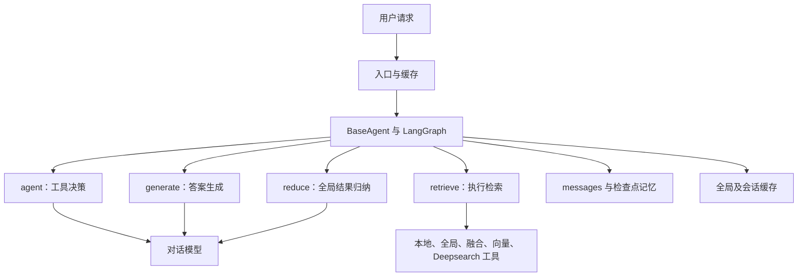
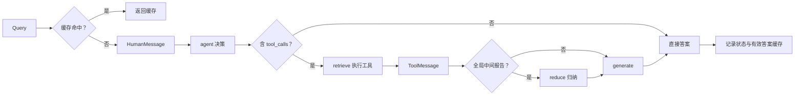
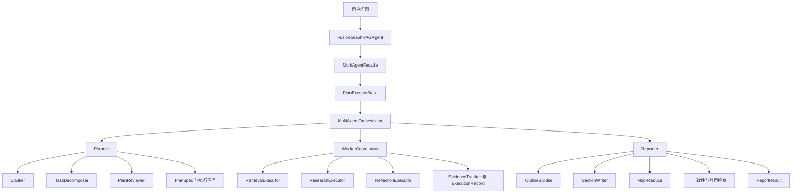
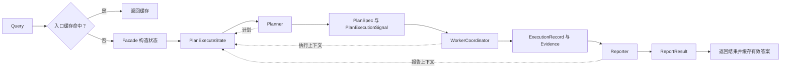

KG-Deepsearch 将多格式医疗文档转换为图谱与文本证据，再用多轮检索和多智能体编排生成问答及长报告。系统主要处理四个问题：同一实体反复建点、通用模型抽取成本较高、多跳问题缺少完整证据，以及检索与长文写作耦合后难以追踪。

本文按“构图—抽取训练—检索—编排—评测”组织项目材料。实验数字均为材料中的内部记录，没有在本次整理中重跑。医学名称仅用于演示图谱连接与文本抽取，不意味着这些示例足以支持临床判断；对于来源中的定义冲突和算术错误，下面分别标明。

## 目录

## 1. 系统分层与数据流

构建阶段读取 PDF、Word 等文档，分词后采用重叠滑窗分块。每个 chunk 保留文档标识与原文位置，抽取实体和关系后写入 Neo4j；实体描述与文本向量参与召回、相似节点候选发现及查询排序。

查询阶段根据问题选择向量、本地、全局、融合或 CoE 链式检索。Deepsearch 负责把复杂问题拆成子查询，多轮补充证据；Plan-Execute-Report 工作流进一步分离规划、执行与报告生成。

| 层次         | 主要输入              | 主要输出                     |
| ------------ | --------------------- | ---------------------------- |
| 文档处理     | 多格式文档            | 带来源与位置的 chunk         |
| 实体关系抽取 | chunk 与 schema       | `entities`、`relations` JSON |
| 消歧与对齐   | 抽取提及、已有图节点  | 规范节点、关系与别名映射     |
| 图谱检索     | query、起点实体与策略 | 实体、关系、路径、原始文本   |
| Deepsearch   | 问题与累计证据        | 多轮检索结果、冲突与答案     |
| 多智能体编排 | 原始问题与任务计划    | 执行记录、引用与结构化报告   |

这里的 CoE 指本项目使用的实体链式探索机制；图谱检索工具、本项目的多轮 Deepsearch 和多智能体编排是不同层级，不能把它们视为同一个算法。

## 2. 图谱质量：实体消歧与实体对齐

### 2.1 两类重复来源

直接把每个 chunk 的抽取结果写入图谱，会把不同名称当成不同节点。例如“2型糖尿病”“II型糖尿病”“糖尿病2型”“T2DM”可能指向同一实体。另一些名称相似的节点可能代表不同概念，不能仅凭字符串相似合并。

实体消歧处理**新提及应链接到哪个已有节点**；实体对齐处理**图中已有的多个节点是否应合并**。二者分别作用于增量写入和存量清理。

```json
{
  "nodes": [
    { "id": "2型糖尿病", "type": "Disease" },
    { "id": "II型糖尿病", "type": "Disease" },
    { "id": "糖尿病2型", "type": "Disease" },
    { "id": "T2DM", "type": "Disease" }
  ],
  "edges": [
    ["2型糖尿病", "has_symptom", "多尿"],
    ["II型糖尿病", "need_check", "空腹血糖"],
    ["T2DM", "need_check", "糖化血红蛋白"]
  ]
}
```

### 2.2 新提及：字符串召回与向量重排

先归一化名称，处理标点、空格、罗马数字与阿拉伯数字，再结合编辑距离和 n-gram 重叠召回候选。随后对“提及 + 上下文”和“候选名称 + 描述 + 上下文”计算向量相似度，融合字符串与语义分数后重排。

```json
{
  "mention": "T2DM",
  "reranked_candidates": [
    {
      "entity": "2型糖尿病",
      "string_score": 0.42,
      "semantic_score": 0.95,
      "final_score": 0.74
    },
    {
      "entity": "II型糖尿病",
      "string_score": 0.31,
      "semantic_score": 0.89,
      "final_score": 0.66
    },
    {
      "entity": "糖尿病2型",
      "string_score": 0.28,
      "semantic_score": 0.87,
      "final_score": 0.63
    }
  ]
}
```

这些分数是原文的说明性样例，未给出融合权重。最高分低于阈值时标为未知实体，高于阈值时链接到已有节点，将新关系挂到规范节点上。字符串召回若漏掉英文缩写对应的中文名称，后续向量重排也无法恢复，因此候选召回覆盖率和别名库需要单独检查。

### 2.3 存量节点：KNN 候选组与冲突判别

将节点名称、描述、关系上下文和邻居编码为向量，KNN 找到相似节点并构建相似边；在相似图上计算弱连通分量 WCC，形成对齐候选组。WCC 只表示相似边连通，不意味着组内所有节点都属于同一个实体，不能把候选组直接整体合并。

对组内节点计算关系类型的 Jaccard 相似度，再比较具体邻居、描述及原文。对证据冲突的候选，交给 LLM 综合判断并保留理由。

$$
J(A,B)=\frac{|\mathrm{Rel}(A)\cap\mathrm{Rel}(B)|}{|\mathrm{Rel}(A)\cup\mathrm{Rel}(B)|}.
$$

```text
A 的关系类型 = {has_symptom, need_check, cure_department}
B 的关系类型 = {has_symptom, need_check}
C 的关系类型 = {need_check}
D 的关系类型 = {cure_department}

J(A, B) = 2 / 3 ≈ 0.67
J(A, C) = 1 / 3 ≈ 0.33
J(A, D) = 1 / 3 ≈ 0.33
```

此处统一使用原节点示例中的集合。源文后续把 C 的集合改成与 A 相同，又将 $1/3$ 写成 0.63；这些不能作为计算结果保留。关系类型重叠只是粗筛，常见疾病都可能连接到症状、科室和检查节点，仍需核对具体语义。

```json
{
  "entity_a": {
    "name": "2型糖尿病",
    "relations": ["cure_department:内分泌科"]
  },
  "entity_b": { "name": "妊娠糖尿病", "relations": ["cure_department:妇产科"] },
  "decision": {
    "same_entity": false,
    "reason": "名称相近不足以合并，需区分概念定义、适用人群与原文上下文"
  }
}
```

### 2.4 构图指标

材料记录对齐优化后，重复节点率由 15% 降到 4%，关系冲突率由 8% 降到 2%。没有提供各阶段总节点数、判定样本量和阈值，因此保留为内部记录。

若确认重复组为 $g_1,\ldots,g_k$，冗余节点数是 $D=\sum_i(|g_i|-1)$，重复节点率为 $D/N$。例如三个组大小为 3、2、4，共产生 6 个冗余节点。若整张图确有 1000 个节点，重复率才是 0.6%；源文只列出 12 个示例节点，不能直接将这 12 个节点的集合视为 1000 节点总体。

“关系冲突率”在材料中实际按**候选组是否至少存在一对关系类型交并比低于阈值**计算：

$$
\mathrm{ConflictRate}=\frac{\text{触发冲突筛查的候选组数}}{\text{处理的候选组总数}}.
$$

因此它更接近结构不一致触发率。关系集合不同也可能只是信息缺失，不能直接解释为真实语义矛盾，更不能据此证明图谱事实正确。

## 3. 本地实体关系抽取：从 SFT 到 GRPO

### 3.1 为什么单独训练抽取模型

构图总成本包括解析、chunk 抽取、embedding、图写入、消歧对齐和社区构建。实体关系抽取对每个 chunk 都执行，而且输出结构相对固定，适合由本地模型专门处理。

材料使用 Qwen3-4B，通过 SFT 学习结构化输出，再用 GRPO 优化实体 F1、关系 F1、schema 合法率与原文支持率。下面的抽取示例只演示输入到 JSON 的转换。

```json
{
  "doc_id": "doc_001",
  "chunk_id": "doc_001_chunk_03",
  "text": "示例疾病甲的资料中列出症状乙、检查丙和科室丁。",
  "metadata": {
    "source": "medical_corpus/example.txt",
    "offset_start": 1200,
    "offset_end": 1230
  }
}
```

```json
{
  "entities": [
    { "name": "疾病甲", "type": "Disease" },
    { "name": "症状乙", "type": "Symptom" },
    { "name": "检查丙", "type": "Check" },
    { "name": "科室丁", "type": "Department" }
  ],
  "relations": [
    {
      "head": "疾病甲",
      "head_type": "Disease",
      "relation": "has_symptom",
      "tail": "症状乙",
      "tail_type": "Symptom"
    },
    {
      "head": "疾病甲",
      "head_type": "Disease",
      "relation": "need_check",
      "tail": "检查丙",
      "tail_type": "Check"
    },
    {
      "head": "疾病甲",
      "head_type": "Disease",
      "relation": "belongs_to",
      "tail": "科室丁",
      "tail_type": "Department"
    }
  ]
}
```

### 3.2 从结构化疾病数据构造训练样本

原始数据以疾病为中心，含简介、病因、预防、症状、检查、科室、并发症、治疗方式、药品和食物等字段。将可枚举关系映射为 `(head, relation, tail)` 三元组，疾病作为头实体，其余说明作为实体属性保留。

数据处理包含三元组去重、实体属性长文本裁剪、每种关系最多 12 个不同尾实体、每个样本最多 80 条关系，再把疾病、属性和按关系分组的尾实体重构为输入文本。材料记录 9K 训练、1K 验证。

**Schema 口径需要区分。**源文部分段落称“8 类实体、11 类关系”，但训练样例明确列出 7 类实体、10 类关系：

```json
{
  "entity_types": [
    "Check",
    "Cure",
    "Department",
    "Disease",
    "Drug",
    "Food",
    "Symptom"
  ],
  "relation_types": [
    "acompany_with",
    "belongs_to",
    "common_drug",
    "cure_way",
    "do_eat",
    "has_symptom",
    "need_check",
    "no_eat",
    "recommand_drug",
    "recommand_eat"
  ]
}
```

后文图谱路径又出现 `Producer` 和 `drugs_of`，可能涉及扩展图谱，但原文未明确版本关系。抽取训练 schema 与查询图谱 schema 不应混用。本文训练说明以实际列出的 7／10 为准，不声称已核对真实代码；`acompany_with`、`recommand_drug` 等拼写作为原 schema 键保留。原文同时使用 `cure_department` 和 `belongs_to` 表达科室关系，复现前还需统一映射。

```json
{
  "id": "diseasekg_000001",
  "task": "medical_entity_relation_extraction",
  "instruction": "抽取文本明确支持的实体与关系，按给定 schema 输出 JSON。",
  "input": "疾病名称：疾病甲。常见症状：症状乙。",
  "output": {
    "entities": [
      { "name": "疾病甲", "type": "Disease" },
      { "name": "症状乙", "type": "Symptom" }
    ],
    "relations": [
      {
        "head": "疾病甲",
        "head_type": "Disease",
        "relation": "has_symptom",
        "tail": "症状乙",
        "tail_type": "Symptom"
      }
    ]
  },
  "meta": { "source": "DiseaseKG", "disease": "疾病甲", "triple_count": 1 }
}
```

GRPO 复用 instruction 与 input 作为 prompt，目标实体关系集合移到 `reference` 用于计算奖励；schema 继续用于合法性检查。真实 PDF／Word chunk 与模板重构文本存在分布差异，材料提出用较强模型抽取真实 chunk、经过规则过滤和人工抽检后加入训练，以改善覆盖。其新增数量与是否进入最终实验未完整记录。

### 3.3 SFT 序列与交叉熵

按 Qwen 模板编码输入和标准 JSON。`source_ids` 包含 system、user 与 assistant 起始标记，`target_ids` 包含回答和模板规定的一次终止标记：

```python
input_ids = source_ids + target_ids
labels = [-100] * len(source_ids) + target_ids
```

labels 是输出 token 的监督信号，不是实体类别标签。只对 assistant 部分计算交叉熵：

$$
\mathcal L_{\mathrm{SFT}}=-\frac{1}{\sum_t m_t}\sum_t m_t\log p_\theta(y_t\mid x,y_{<t}).
$$

```python
import torch.nn.functional as F

# 损失计算片段，logits 与 labels 来自已编码的训练批次。
shift_logits = logits[:, :-1, :].contiguous()
shift_labels = labels[:, 1:].contiguous()
loss = F.cross_entropy(
    shift_logits.view(-1, shift_logits.size(-1)),
    shift_labels.view(-1),
    ignore_index=-100,
)
```

记录配置为 Qwen3-4B-Base、2 × A800 80 GB、9K 样本、最大长度 2048、LoRA rank 16／alpha 32、每卡 batch size 2；1 epoch 约 1 小时，3 epochs 约 3 小时。应同时看训练 loss 与验证关系 F1，避免只因 loss 下降就继续训练。

### 3.4 GRPO 的任务奖励

SFT 模型作为初始策略与冻结参考策略，每个 prompt 采样 4 个 JSON 候选。无法解析为合法 JSON 的输出直接给 `reward = -1.0`；其余输出计算四项指标并加权，材料说明关系 F1 权重最高、实体 F1 次之，但未提供具体权重值。

| 奖励分量      | 判定对象                            | 不能推出的结论               |
| ------------- | ----------------------------------- | ---------------------------- |
| 实体 F1       | `(实体名, 类型)` 预测集合与标准集合 | 不能证明输入知识正确         |
| 关系 F1       | `(头实体, 关系, 尾实体)` 集合       | 名称匹配仍依赖规范化规则     |
| Schema 合法率 | 实体与关系类型是否在当前 schema 中  | 格式正确不等于关系正确       |
| 原文支持率    | 名称或端点能否在输入文本找到        | 两端出现不等于关系被原文支持 |

源文把最后一项称为 Faithfulness／真实性。若实现仅检查实体字符串及关系端点出现，它只是原文支持的代理指标；要严格检查关系忠实性，还需要确认原文是否表达相同方向与语义。

组内相对优势为：

$$
\hat A_i=\frac{R_i-\overline R}{\operatorname{std}(R_1,\ldots,R_G)+\varepsilon_{\mathrm{num}}}.
$$

数值稳定项防止同组奖励全部相同时除零。定义概率比 $\rho_{i,t}=\pi_\theta(o_{i,t}\mid q,o_{i,<t})/\pi_{\mathrm{old}}(o_{i,t}\mid q,o_{i,<t})$，目标写为：

$$
\mathcal J(\theta)=\mathbb E\left[\frac1G\sum_{i=1}^G\frac1{|o_i|}\sum_t
\left(\min\{\rho_{i,t}\hat A_i,\operatorname{clip}(\rho_{i,t},1-\epsilon,1+\epsilon)\hat A_i\}
-\beta D_{\mathrm{KL},i,t}\right)\right].
$$

裁剪目标限制单次策略偏移，KL 约束用于保留 SFT 输出能力。GRPO 不单独训练价值模型。源文将选择原因写为“没有偏好对无法做 PPO/DPO”，其中 DPO 确实需要偏好数据，但 PPO 也可使用规则奖励；本项目选择 GRPO 更准确的理由是任务指标可计算，并可采用组内基线。

GRPO 记录配置为 9K prompts、每题 4 个候选、最大输入约 1024、最大回答约 512 tokens、每卡 batch size 2、2 × A800 80 GB；1 epoch 约 5 小时，3 epochs 约 12 小时，1K 评测推理约 15 分钟。

### 3.5 抽取评测结果

集合匹配指标使用：

$$
P=\frac{|\mathrm{Pred}\cap\mathrm{Gold}|}{|\mathrm{Pred}|},\qquad
R=\frac{|\mathrm{Pred}\cap\mathrm{Gold}|}{|\mathrm{Gold}|},\qquad
F_1=\frac{2PR}{P+R}.
$$

实现需要定义空集合处理、实体规范化，以及按样本平均还是全局累计；原材料未完整列出。Schema 分数记录为实体合法比例与关系合法比例的等权平均。时延是调用结束时间减开始时间，再在样本上平均。

| 方案                  | 关系 F1 | 实体 F1 | Schema | 原文支持率 | 平均抽取时延 |
| --------------------- | ------- | ------- | ------ | ---------- | ------------ |
| 通用 LLM 基线         | 80.2%   | 86.1%   | 93.8%  | 89.4%      | 3.2 秒       |
| Qwen3-4B + SFT        | 78.9%   | 78.5%   | 85.8%  | 81.3%      | 1.0 秒       |
| Qwen3-4B + SFT + GRPO | 87.6%   | 89.4%   | 96.5%  | 92.5%      | 1.0 秒       |

| 规模对照 | 关系 F1 | 实体 F1 | Schema | 原文支持率 | 平均时延 |
| -------- | ------- | ------- | ------ | ---------- | -------- |
| 0.6B     | 76.5%   | 84.8%   | 91.2%  | 87.8%      | 0.45 秒  |
| 1.7B     | 82.9%   | 87.6%   | 94.5%  | 90.8%      | 0.72 秒  |
| 4B       | 87.6%   | 89.4%   | 96.5%  | 92.5%      | 1.00 秒  |
| 8B       | 88.4%   | 90.0%   | 96.9%  | 93.0%      | 1.95 秒  |

这些是材料所述 1K 评测集上的记录。通用 LLM 名称、推理服务设置、模型规模对照的完整训练条件及重复实验方差未给出；时延可能同时受到服务位置和硬件影响，不能全部归因于模型大小。

## 4. 图检索与 CoE 链式探索

### 4.1 检索方式的分工

| 检索方式 | 问题形态                   | 返回证据                         |
| -------- | -------------------------- | -------------------------------- |
| 向量检索 | 文本中已有直接说明         | 相关 chunk                       |
| 本地检索 | 单个实体的具体关系或属性   | 实体、关系、局部子图与 chunk     |
| 全局检索 | 主题概括和总结             | 社区摘要、中间报告与社区证据     |
| 融合检索 | 同时需要局部细节与主题背景 | 局部与全局合并证据               |
| CoE      | 需要逐步连接实体关系       | 探索路径、访问实体、关系与 chunk |

### 4.2 起点、策略与邻居评分

CoE 接收 query 与起点实体，把起点写入 `visited_nodes`，并记录第 0 步路径。从当前实体取得一跳邻居，排除已访问节点，再结合语义相似度、策略、关系权重与图边权重打分。

```json
{
  "focus_relations": ["has_symptom", "need_check"],
  "focus_entity_types": ["Disease", "Check"],
  "avoid_relations": [],
  "termination_conditions": ["所有子问题均有来源证据"],
  "relation_weights": { "has_symptom": 0.9, "need_check": 0.7 }
}
```

问题复杂度由长度、问号数和“为什么／如果／原因”等词估计。原记录的公式为：

```text
complexity = 0.5 + (0.3 * length_term + 0.3 * question_term + 0.4 * keyword_term) / 3
complexity 限制在 0.5～1.5
```

各特征的归一化没有给出，所以 0.95 阈值只应视为项目启发式参数。复杂度不超过 0.95 时采用默认策略；更复杂时由 LLM 生成关注关系、实体类型和终止条件。

```text
final_score = similarity * strategy_score * relation_weight * graph_weight
```

原文打分示例在 `graph_weight = 1` 的假定下如下，最终分数不是概率：

| 候选       | 相似度 | 策略分 | 关系权重 | 最终分 |
| ---------- | ------ | ------ | -------- | ------ |
| 候选疾病 A | 0.82   | 1.8    | 1.2      | 1.77   |
| 候选疾病 B | 0.71   | 1.8    | 1.2      | 1.53   |
| 候选科室 C | 0.46   | 1.1    | 1.1      | 0.56   |
| 候选食谱 D | 0.18   | 0.5    | 1.0      | 0.09   |

默认选择排名靠前的 3 个节点。材料描述复杂问题且第 3／4 名差距小于 8% 时调用 LLM 辅助选择，但未明确差距的归一化分母，不能把该条件当作完整可复现规则。

### 4.3 动态宽度与停止条件

每一跳根据深度、邻居数量和问题复杂度调整宽度，限制在 1～5。下面保留原策略的计算逻辑，改为独立可读的函数：

```python
def exploration_width(step, neighbor_count, complexity, base_width=3):
    """宽度计算示意；complexity 由外部启发式函数提供。"""
    step_factor = max(0.5, 1.0 - step * 0.2)
    neighbor_factor = min(1.5, max(neighbor_count, 1) / 10)
    adjusted_width = int(base_width * step_factor * neighbor_factor * complexity)
    return max(1, min(5, adjusted_width))
```

虽然宽度最少返回 1，没有候选时仍应先终止，不能凭空补节点。材料默认最多探索 3 轮；没有新邻居、候选都已访问或没有待扩展实体时提前停止。下一跳依赖当前结果，跨跳不能随意并行；同一跳中独立的数据获取仍可批处理。

```json
{
  "exploration_path": [
    { "step": 0, "node_id": "症状乙", "action": "start" },
    {
      "step": 1,
      "node_id": "疾病甲",
      "action": "explore",
      "reason": "与当前约束相关"
    },
    {
      "step": 2,
      "node_id": "并发症戊",
      "action": "explore",
      "reason": "补充后续子问题证据"
    }
  ],
  "evidence_ids": ["chunk_102", "chunk_104"]
}
```

## 5. Deepsearch：多轮查询与证据链

### 5.1 从子问题到累计证据

Deepsearch 为原问题创建 query ID、抽取关键词并拆分子问题。先利用社区摘要确定搜索方向，再以相关实体发起 CoE，构建临时查询图，选出下一轮需要关注的核心实体。

每轮可以组合图检索、向量检索与 CoE。原始 chunk、实体和关系进入证据池；模型提炼出的中间结论必须继续关联原始来源。没有新查询、子问题已覆盖或达到轮数限制时终止。生成最终答案前，检查累计证据是否冲突，并把冲突一并交给生成阶段。

```json
{
  "query_id": "query_0001",
  "initial_sub_queries": [
    "哪些实体满足症状与检查两个约束？",
    "这些实体与哪些科室相连？",
    "候选实体有哪些相关并发症证据？"
  ],
  "kbinfos": {
    "chunks": [{ "chunk_id": "chunk_102", "text": "可回溯的原始文本占位" }],
    "entities": ["疾病甲", "症状乙"],
    "relationships": [["疾病甲", "has_symptom", "症状乙"]]
  }
}
```

最终结果包含答案、检索信息、过程摘要、证据统计与冲突列表。这里的过程记录是系统可观测的操作及证据说明，不应被当成模型内部推理真实性的证明。

### 5.2 记录每个决策点

证据链记录以下事件：问题拆分、社区分析、临时图构建、迭代开始／停止、子查询执行、跟进查询、矛盾检测和最终综合。每个事件包含 query ID、step ID、操作、关联证据与时间，便于追溯失败位置。

```json
{
  "step_id": "step_3",
  "query_id": "query_0001",
  "search_query": "sub_query_2",
  "reason": "上一轮尚缺科室关系的直接来源",
  "evidence_ids": ["evidence_102"],
  "timestamp": 1710000001.0
}
```

证据对象区分原始文本、图结构、提炼知识、冲突信息与综合结论：

```json
{
  "evidence_id": "evidence_102",
  "source_id": "chunk_102",
  "source_type": "original_chunk",
  "content": "原文证据占位",
  "metadata": { "query_id": "query_0001", "doc_id": "doc_001" }
}
```

材料中曾给提炼结论固定 0.85 置信分，但没有校准方法。模型摘要不应仅因被写入证据池就升级为“高置信事实”；引用最终需要落到原文或有来源的图谱关系，而非只引用另一段生成文本。

### 5.3 多级缓存与时延来源

缓存分为三层：Agent 层缓存最终答案，工具层缓存关键词、子问题、检索结果和提炼证据，CoE 层缓存路径与节点选择决策。会话缓存按 thread ID 隔离；全局缓存先精确匹配，再以向量相似度匹配历史查询。

图谱查询的成本不仅是数据库执行。每次还包括连接池取连接、网络往返、索引查找与结果传输。材料描述一轮 CoE 内可能顺序获取邻居、类型、实体详情、关系、chunk 和社区，共产生多次往返；邻居描述与 chunk 的重复 embedding 也会放大延迟。

已有缓存能够减少重复工作，但语义相近的问题可能在否定、时间或人群条件上不同。跨会话复用应检查上下文与图谱版本；不能从材料中推断这些失效与隔离机制已经实现。

### 5.4 多跳数据与评测记录

材料从图谱路径生成问题，标注标准答案、关系、证据 ID 与关键结论，构造约 1K 多跳问题。题型包括链式关系和多条件聚合。需要注意：一组疾病中心的四条星形关系，代表四个约束，并不自动构成连续四跳路径；源文将这类样本记为 `hop_count: 4`，后续应区分约束数与真实路径长度。

| 1K 多跳评测          | 基线记录 | CoE 增强后 |
| -------------------- | -------- | ---------- |
| 答案词集合重叠 F1    | 64%      | 72%        |
| 启发式“推理深度”分数 | 58%      | 80%        |
| 启发式关系利用分数   | 46%      | 63%        |

源文同时将基线描述为“Deepsearch 使用 CoE 前”和“普通 GraphAgent”，实际基线实现需核对。答案 F1 是格式清理、jieba 分词后计算词集合重叠，不是语义正确率。

“推理深度”由查询数、过程段落数和信息提炼段数加权，材料给出：

```text
feature_score = 0.6 + min(0.2, 0.05 * query_count)
                    + min(0.1, 0.02 * depth_level)
                    + min(0.1, 0.05 * info_count)
```

该公式对非负计数的最低值为 0.6，与表中 58% 不一致，可能还有未记录的分支或聚合规则。在代码与日志补齐前，不能声称该公式复现了表格，也不能把更多查询或更长文本等同于更深推理。

关系利用分数由数量、质量与相关性组成：

```text
quantity = min(1.0, 0.1 * relationship_count)
quality = 关系描述、类型多样性和端点有效性的启发式评分
relevance = 关系涉及实体与引用实体的重合程度
score = min(1.0, 0.3 + 0.7 * (0.3 * quantity + 0.4 * quality + 0.3 * relevance))
```

它不是“正确使用的标准关系／标准关系总数”的直接比例。应保留分项和算法版本，避免误读。

## 6. 单 Agent：消息状态驱动的问答流程

### 6.1 模块与职责

单 Agent 采用 LangGraph `StateGraph` 维护消息状态，决策节点调用模型，`ToolNode` 执行检索，必要时归纳全局报告，再生成答案。模型层负责对话与 embedding，工具层封装不同检索方式，记忆层按 thread ID 保存状态。



各节点通过消息通信：用户输入为 HumanMessage，工具请求是带 `tool_calls` 的 AIMessage，工具输出是对应调用 ID 的 ToolMessage，最终答案再写入 AIMessage。`add_messages` 合并新增消息，检查点按 thread ID 保存会话进度。

### 6.2 一次工具决策的通信路径



材料中的文字路由写无 tool call 时 `agent → END`，另一幅原图画为进入 generate。本文统一表达为“已有直接答案则结束”，不据此虚构真实代码路径。最关键的结构事实是：检索后没有回到 agent 的外层反复决策，通常是一次决策、一次工具阶段、一次生成。Deepsearch 工具内部可以多轮检索，但这不等于外层采用了完整 ReAct 循环。

### 6.3 故障处理与局限

入口使用会话互斥，避免同一 thread 同时修改状态。关键词抽取失败时保留原问题；工具调用先规范化 ID、名称与 query，合法别名可映射，参数为空可回退原始问题。检索超时或为空时尝试已注册的默认检索，仍无证据则返回信息不足。

LLM 超时或空输出应返回可识别错误。缓存写入失败记录日志而不影响已成功的回答；过短、错误或“无法获取信息”等失败结果不进入缓存。不过仅检查长度与关键词不能保证答案正确。

这种结构易于理解，工具与缓存职责明确，但外层没有自动检查证据充分性或生成质量，也没有完整的反思重试闭环。给 Agent 只挂相关的少量工具，可以减少说明占用和错误选择；工具多并不等于能力强。

## 7. 多智能体：Plan-Execute-Report 编排

### 7.1 规划、执行、报告分工

多智能体入口经 Facade 转为共享状态 `PlanExecuteState`。Planner 生成任务 DAG；WorkerCoordinator 按依赖调度检索、研究和反思执行器；Reporter 基于证据生成大纲、章节与最终报告。



| 共享状态部分      | 主要字段与用途                                                     |
| ----------------- | ------------------------------------------------------------------ |
| 会话与输入        | 会话 ID、原问题、澄清后的问题、领域上下文                          |
| `PlanSpec`        | 任务 ID、类型、描述、优先级、依赖、参数、实体、验收条件与状态      |
| 执行上下文        | 当前任务、完成列表、中间结果、检索缓存、工具历史、错误与证据注册表 |
| `ExecutionRecord` | 任务输入、执行器、工具、证据、反思结果与耗时                       |
| 报告上下文        | 报告 ID、大纲、章节草稿、引用、一致性检查、报告类型与缓存          |
| 最终结果          | 普通答案或完整报告及结果状态                                       |

Planner 先澄清任务对象、信息是否完整及输出形态，再生成任务图，检查缺失依赖与循环。Executor 执行就绪任务，产出统一 `RetrievalResult` 和记录；Reporter 读取这些记录，不直接把未经登记的模型生成内容当作证据。

### 7.2 标准对象与返回值通信



`PlanExecuteState` 承载上下文，`PlanExecutionSignal` 传递计划执行意图，任务执行器返回标准结果，最终输出为 `ReportResult`。与单 Agent 的消息链相比，结构化对象更利于追踪依赖和证据，但要求任务 ID、状态、工具结果和错误语义保持一致。

任务 DAG 支持表达独立任务；实际并发效果仍取决于执行器实现。共享状态并发写入的改进方向是任务返回局部记录，由统一状态管理入口合并。原文的“一个线程完成再执行下一个”实为串行，不应描述为并行优化。

### 7.3 反思与局部重试

反思执行器从任务中间结果和证据文本检查回答长度、关键词覆盖、失败信息与一致性，给出是否重试及补充查询建议。控制器按目标任务 ID 重跑对应任务，再次反思，直到通过、失败或达到重试上限。

该机制把失败定位到具体任务，避免整篇报告每次从头生成。但关键词覆盖是启发式质量检查，不能替代证据与结论之间的语义支持验证。

### 7.4 失败状态与降级策略

顶层结果分为需要澄清、部分成功、失败和成功。成功的子任务记录应在其他阶段失败时保留，不能把部分证据包装成完整成功报告。

| 失败位置             | 材料中的处理方式                                 |
| -------------------- | ------------------------------------------------ |
| 问题不完整           | Planner 返回需要澄清                             |
| 非法任务图或依赖循环 | 修复或拒绝进入执行，不执行无法确定的计划         |
| 未知执行器或工具     | 检查注册表与合法别名；无法识别则失败             |
| 参数缺失             | 使用可确定的原问题或默认参数，仍不合法则失败     |
| 检索无结果           | 重写关键词、调整召回或回退向量／本地检索         |
| Deepsearch 某轮超时  | 限制轮数和时限，保留之前成功结果，反思后局部重试 |
| CoE 无起点或无路径   | 尝试抽取实体，失败则降级；不编造路径             |
| 融合检索单路失败     | 分支错误单独记录，成功证据继续参与融合           |
| 所有检索失败         | 返回失败或信息不足                               |
| 反思仍不通过         | 达到上限后停止，保留失败原因                     |

融合检索的记录采用低层实体／关系／chunk 权重 0.6、高层社区／主题摘要权重 0.4，再结合关键词、相似度和图距离评分、去重。原文未提供完整分数归一化，不能仅靠权重复现合并结果。

### 7.5 报告生成与证据过长

Reporter 首先生成包含标题、摘要、章节证据 ID 和预计字数的大纲，然后按章节选证据写作。证据过多时采用 Map-Reduce：例如 80 条证据按每批 8 条压缩成 10 份摘要，再合并章节。摘要仍需保留原证据 ID，否则压缩会打断引用链。

大纲调用失败可重试一次，仍失败则根据可用证据构建保底结构；章节失败只影响该节，其他章节继续。没有证据的章节显式说明缺失，不补写猜测。无效证据 ID 应移除或修复关联；最后检查报告与证据是否一致，修订后仍失败则返回部分成功。

源文将这些条目混合写作失败处理与改进建议，未提供对应测试记录，因此本文将其作为已描述的设计，不声称每条异常分支都经过验证。

## 8. 多智能体评测与结果解释

### 8.1 数据集结构

问题由图谱路径和模板构建，类型包括多跳关系、比较、分析与长报告；标注关系、原始证据和关键结论，再由 LLM 生成参考大纲。

```json
{
  "id": "report_eval_0001",
  "question": "比较实体 A 与 B 的已知关系并总结证据",
  "question_type": "compare",
  "gold_relations": [
    ["A", "rel_1", "C"],
    ["B", "rel_2", "D"]
  ],
  "key_claims": ["结论占位 1", "结论占位 2"],
  "gold_evidence_ids": ["chunk_12", "chunk_44", "path_3"]
}
```

材料没有完整说明这一报告评测集与上一节 1K 多跳集的关系，不能默认二者相同。图谱生成题目容易偏向已有 schema 和模板，LLM 生成参考答案与评分也可能共享偏差，应另设真实查询与独立核验。

### 8.2 对照结果

| 对照记录                          | 单 Agent | 多智能体 |
| --------------------------------- | -------- | -------- |
| GraphAgent：答案重叠 F1           | 57%      | 65%      |
| GraphAgent：关系利用分数          | 44%      | 58%      |
| GraphAgent：文档连贯性            | 85%      | 92%      |
| DeepsearchAgent：答案重叠 F1      | 74%      | 77%      |
| DeepsearchAgent：证据可追溯覆盖率 | 56%      | 81%      |
| DeepsearchAgent：文档连贯性       | 84%      | 92%      |

原文两组对照的多智能体 F1 分别为 65% 和 77%，但未解释是否对应不同题集、工具配置或运行条件。本文分别保留，不把它们合并成一个统一对照实验，也不与上一节的 64%／72% 串成连续提升曲线。

答案重叠 F1 和关系利用分数沿用前述启发式定义。文档连贯性由段落数、标题、句子数等结构特征与正文一起交给 LLM，输出 0～1 分数；它是评判器分数，不是人工一致性或正确率。

证据可追溯覆盖率定义为：

$$
\mathrm{TraceCoverage}=\frac{\text{能映射到具体证据的关键结论数}}{\text{关键结论总数}}.
$$

能找到引用只说明存在映射，还需要检查证据是否真正支持结论、来源是否可靠、关键限制是否在正文中保留。原材料未提供结论抽取、匹配阈值和人工复核记录。

## 9. 工程取舍与待完善部分

单 Agent 适合证据范围较小的问答，状态简单、调用少；Plan-Execute-Report 适合复杂、多来源、长报告任务，能够分离规划与写作、登记执行记录和局部重试，同时增加模型调用、通信与状态一致性成本。

ReAct 强调工具结果驱动下一步决策，Plan-and-Execute 先建立任务结构，Reflection 检查已产生结果。项目的单 Agent 外层不是完整 ReAct 循环，多智能体架构则把计划执行与局部反思组合在一起。范式名称应以真实控制流为依据。

工程侧模型通过兼容 OpenAI API 的接口接入，材料记录用环境配置切换地址、密钥与模型。选型关注工具调用、JSON 稳定性、中文长文本、吞吐和成本，但缺少模型确切版本与服务配置，不能据此给出可复现的选型排名。

后续需要优先补齐以下内容：

1. **数据与 schema 版本。**确定 7／10 与 8／11 的对应关系，统一科室关系别名，区分抽取 schema 与扩展图谱。
2. **评测定义。**补齐去重、集合空值、F1 聚合和规则阈值，修正推理深度公式与结果冲突，区分真实跳数和约束数。
3. **来源约束。**图节点、关系、摘要与最终结论均保留原始 chunk 来源，避免生成摘要循环引用自身。
4. **性能证据。**记录完整调用链的时延、token 与成本，而不只展示单次抽取耗时；明确缓存命中率和硬件差异。
5. **异常与并发验证。**检查部分失败、无路径、引用失效、重试上限、会话隔离及图谱更新后的缓存失效。

项目的价值在于把抽取质量、检索路径、任务执行和报告引用连接成可追踪的数据流。现有材料能够展示这套设计及内部实验记录；指标的独立性、口径与来源补齐后，才能进一步判断它在真实查询中的泛化与可靠性。
