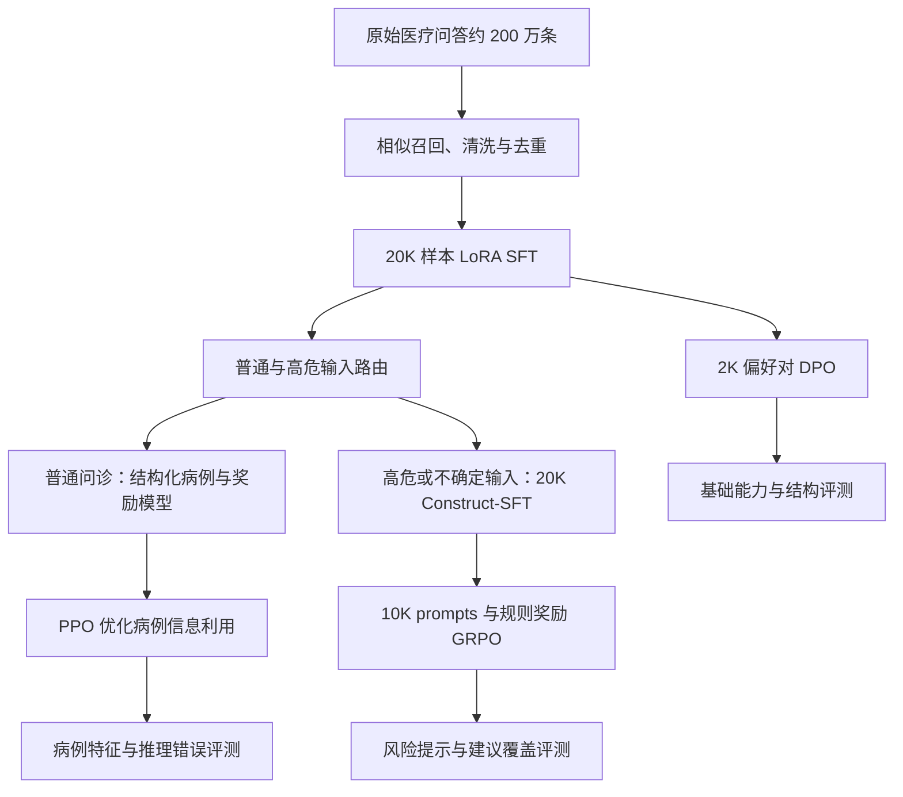

MedQwen 围绕 Qwen3-8B-Base 组织了一条医疗领域后训练链路：先通过相似样本召回改善监督微调的数据分布，再用偏好优化补齐回答结构；随后将普通问诊与高危／不确定输入分流，分别研究奖励模型驱动的 PPO 和规则奖励驱动的 Construct-SFT + GRPO。

这条链路有三个不同目标：医学选择题表现、回答对病例信息的利用，以及安全信息的覆盖。它们需要分别评估，不能用一个分数替代。本文保留项目材料中的实验记录，同时明确数据划分与指标口径尚未核实的部分。文中的 JSON 和回答模板用于说明训练接口，临床输出采用占位文本，不作为诊疗示范。

## 1. 总体设计与结果边界

基础能力训练与问诊分支的起点不同。召回-SFT + DPO 是基础医疗问答方案；路由与普通问诊 PPO 的材料描述使用召回-SFT 模型作为起点；急症 GRPO 使用 Construct-SFT 模型作为初始策略和参考策略。不能把这些阶段未经区分地理解为一个模型连续经历所有训练。



原始记录包含以下主要结果。它们来自不同评测任务，不能直接横向比较。

| 阶段或任务             | 对照结果   | 优化后记录                | 评测说明                          |
| ---------------------- | ---------- | ------------------------- | --------------------------------- |
| 基础医学选择题         | Base 72.7% | 召回-SFT 81.3%，DPO 83.5% | 材料标称 818 条，划分名称存在冲突 |
| 基础回答结构覆盖率     | SFT 75%    | DPO 82%                   | 未完整说明多结构段的聚合方式      |
| 路由高危／不确定召回率 | 未提供对照 | 89%                       | 材料标称 1K 验证集                |
| 普通问诊病例特征利用率 | DPO 68%    | PPO 83%                   | 材料标称 1K 验证集                |
| 普通问诊推理错误率     | DPO 17%    | PPO 7%                    | 规则与 LLM 判定，非临床结局       |
| 急症缺少就医建议比例   | DPO 8%     | GRPO 3%                   | 材料标称 1K 高危验证集            |
| 急症缺少风险提示比例   | DPO 7%     | GRPO 2%                   | 衡量指定内容遗漏                  |

**关键数据限制：**源材料交替使用“CEval 医疗测试集”和“验证集”，同时描述用这些题目召回训练数据，并用 818 条题目评价模型。当前材料无法确定召回查询与最终评测是否隔离，因此上述成绩只能视为项目内部记录，不能据此声称无污染的测试集泛化提升。需要核对原始划分、题目 ID、召回日志和最终评测文件后，才能作更强结论。

## 2. 召回-SFT：先改善训练数据分布

### 2.1 从混合数据到目标相关样本

最初使用 6K 通用数据和 50K 医疗数据进行 SFT，材料记录医学选择题准确率从 Base 的 72.7% 降至约 70%。数据量增加没有自动转化为目标任务收益，因此后续改为向量召回。

具体流程是将医学题目向量化，以约 200 万条医疗问答为候选池，为每道 query 召回 Top 50；保留余弦相似度高于阈值 $T$ 的候选，去重、清洗并转换为 ShareGPT 格式，得到约 20K 样本。原文未提供 embedding 模型版本和 $T$ 的具体取值。

$$
\operatorname{sim}(q,d)=\frac{\boldsymbol e_q^\top\boldsymbol e_d}{\|\boldsymbol e_q\|_2\|\boldsymbol e_d\|_2}
$$

相似度只负责筛选相关候选，不能证明候选答案医学正确。原文的召回样例存在问答语义不匹配，原始回答还混用了药物中英文名称；整理时不保留这些内容作为正确答案，而用下面的接口占位示例说明数据结构。

```json
{
  "id": "query_0001",
  "question": "医学知识问题占位",
  "matches": [
    {
      "id": "candidate_0001",
      "instruction": "回答给定的医学知识问题",
      "input": "候选问题占位",
      "output": "需要经过质量核验的候选答案占位",
      "match_score": 0.6751
    }
  ]
}
```

ShareGPT 样本将输入放在 `human`，目标回答放在 `gpt`：

```json
{
  "conversations": [
    { "from": "human", "value": "经清洗的输入问题" },
    { "from": "gpt", "value": "经核验的目标回答" }
  ]
}
```

### 2.2 只对回答 token 计算损失

按 Qwen 对话模板拼接 system、user 与 assistant。下面展示序列结构；实际终止符应由所用 tokenizer 与 chat template 决定，避免手工重复添加。

```text
<|im_start|>system
You are a helpful assistant.<|im_end|>
<|im_start|>user
经清洗的输入问题<|im_end|>
<|im_start|>assistant
经核验的目标回答<|im_end|>
```

将 system、user 和 assistant 起始标记记作 `source_ids`，回答及一次终止标记记作 `target_ids`：

```python
# 序列拼接示意，target_ids 已包含模板要求的终止标记。
input_ids = source_ids + target_ids
labels = [-100] * len(source_ids) + target_ids
```

自回归交叉熵在因果位置对齐后，仅计算 assistant 位置：

$$
\mathcal L_{\mathrm{SFT}}
=-\frac{1}{\sum_t m_t}\sum_t m_t\log\pi_\theta(y_t\mid x,y_{<t}),
$$

其中 $m_t$ 表示该 token 是否属于目标回答。除训练／验证 loss 外，还需同时观察医学选择题、结构覆盖率、回答长度和内容错误，避免只优化模板或长度。

### 2.3 LoRA 配置与成本记录

LoRA 冻结原始线性层权重，只训练低秩增量：

$$
h=Wx+\frac{\alpha}{r}BAx.
$$

材料将 LoRA 加在 attention 与 MLP 的线性层上，使用 rank 16、alpha 32。具体 target modules 未列出，复现时还需要训练配置。

| 配置            | 记录值                                |
| --------------- | ------------------------------------- |
| 基础模型        | Qwen3-8B-Base                         |
| 设备            | 2 × A800 80 GB                        |
| 训练样本        | 20K                                   |
| 最大长度        | 2048 tokens                           |
| 每卡 batch size | 2                                     |
| 训练时间        | 1 epoch 约 3 小时，3 epochs 约 8 小时 |
| 医学题推理时间  | 818 条约 4 分钟                       |

这些耗时是原文记录，不代表固定硬件上的可复现基准；梯度累积、精度、软件版本和评测批量仍需补齐。

### 2.4 医学选择题评测

材料将 818 条细分为医师资格 443 条、临床医学 200 条、基础医学 175 条，统一构造四选一 prompt：

```text
问题：{question}
A. {A}
B. {B}
C. {C}
D. {D}
请只回答选项字母(A/B/C/D)。
```

Base 与各训练阶段应使用相同模板、确定性解码、最大生成长度和答案解析规则。记录中的“temperature 为 0”表达确定性推理意图；具体推理框架可能需要设置贪心解码。最终准确率按有效题目中答对数量计算，同时单独记录无法解析的输出，不能静默丢弃失败样本。

## 3. DPO：用偏好对改善回答结构

### 3.1 偏好数据构建

召回-SFT 的结构覆盖率记录为 75%，常见缺项包括判断依据、风险提示和后续建议。DPO 阶段构造约 2K 偏好对，同一问题下比较 `chosen` 与 `rejected`。

正例从召回候选中进行规则过滤与综合评分：去掉过短、重复或缺少必要结构的回答，再结合语义相关性、文本重合度、结构完整性与术语信息筛选。负例包含结构缺失、推理跳步、过度断言、建议泛化、忽略年龄／病程／基础病等关键信息，避免模型仅凭标题识别偏好。

```json
{
  "system": "根据提供的信息作出有依据的回答，并保留不确定性。",
  "history": [],
  "question": "病例描述占位",
  "response_chosen": "完整利用已知信息、说明依据和限制的回答占位",
  "response_rejected": "遗漏关键输入或作出无依据断言的回答占位"
}
```

原文称“从 CEval 训练集中选 2K 条”，未列出具体子集与去重后数量。该来源与医学子集的关系尚不明确，不能直接当作已核实的独立 2K 医学题。

### 3.2 DPO 目标与概率计算

策略模型和冻结的 SFT 参考模型分别计算两个回答的条件对数概率。概率统计应只覆盖回答 token；实现仍可使用 token labels 或 mask 提取 log-prob，区别在于最终优化目标不是普通 SFT 交叉熵。

$$
\mathcal L_{\mathrm{DPO}}
=-\mathbb E_{(x,y_w,y_l)\sim\mathcal D}
\log\sigma\left[
\beta\log\frac{\pi_\theta(y_w\mid x)}{\pi_{\mathrm{ref}}(y_w\mid x)}
-\beta\log\frac{\pi_\theta(y_l\mid x)}{\pi_{\mathrm{ref}}(y_l\mid x)}
\right].
$$

```text
policy_chosen   = log πθ(chosen | prompt)
policy_rejected = log πθ(rejected | prompt)
ref_chosen      = log πref(chosen | prompt)
ref_rejected    = log πref(rejected | prompt)

margin = (policy_chosen - ref_chosen) - (policy_rejected - ref_rejected)
loss = -log_sigmoid(beta * margin)
```

这一目标可由带 KL 约束的奖励最大化与 Bradley–Terry 偏好模型推导：

$$
\max_\pi\;\mathbb E[r(x,y)]-\beta D_{\mathrm{KL}}(\pi\|\pi_{\mathrm{ref}}),
\qquad
P(y_w\succ y_l\mid x)=\sigma(r(x,y_w)-r(x,y_l)).
$$

最优策略对应的奖励可写为 $r(x,y)=\beta\log[\pi^*(y\mid x)/\pi_{\mathrm{ref}}(y\mid x)]+C(x)$，同一问题的偏好差会消去 $C(x)$。这里是目标推导中的 KL 约束，不应误写成每个 DPO 实现都额外显式加了一项 KL loss。

### 3.3 配置、监控与结果

DPO 记录使用 2 × A800 80 GB，LoRA rank 16、alpha 32，每卡 batch size 2，最大输入 2048、目标回答 512 tokens；1 epoch 约 1 小时，3 epochs 约 3 小时。单步同时涉及两条回答与策略／参考模型，开销高于单条 SFT，但样本总量更小。

监控包括 DPO loss、chosen 胜率、偏好 margin、策略相对参考的漂移，以及每轮后的医学准确率和结构覆盖。离线偏好样本上的平均 log-prob 差只是漂移诊断量，未经相应分布采样不能直接称为精确 KL 散度。

| 基础方案                | 医学准确率 | 结构覆盖率 |
| ----------------------- | ---------- | ---------- |
| Base                    | 72.7%      | 未提供     |
| 通用医疗 SFT，6K + 50K  | 70.0%      | 73%        |
| 召回-SFT，20K           | 81.3%      | 75%        |
| 召回-SFT + DPO，2K      | 83.5%      | 82%        |
| 召回-SFT + RM + PPO，2K | 84.2%      | 82%        |

RM + PPO 的基础对照使用相同 2K 偏好对训练奖励模型，并以其中的问题采样 rollout。原文记录 RM 1／3 轮约 1／2 小时，PPO 1／3 轮约 2／5 小时。这里的实验规模与后文 10K 普通问诊 PPO 不同。

材料还保留了模型规模与模型家族对照：

| 模型名称（原记录） | 医学准确率 | 结构覆盖率 | 相对训练／推理成本 |
| ------------------ | ---------- | ---------- | ------------------ |
| Qwen3-4B-Base      | 77.0%      | 78%        | 0.6×               |
| Qwen3-8B-Instruct  | 82.0%      | 81%        | 1.0×               |
| Qwen3-8B-Base      | 83.5%      | 82%        | 1.0×               |
| Qwen3-14B-Base     | 86.5%      | 84%        | 1.8×               |

| 模型名称（原记录） | Base  | 召回-SFT | SFT + DPO | 最终结构覆盖率 |
| ------------------ | ----- | -------- | --------- | -------------- |
| Qwen3-8B-Base      | 72.7% | 81.3%    | 83.5%     | 82%            |
| Llama-3-8B-Base    | 69%   | 76%      | 78%       | 79%            |

上表保留材料中的模型名称，但没有完整 checkpoint 标识、统一训练条件和成本定义，不能将其作为公开模型排行榜。基础对照未做 GRPO；后面的普通／急症分支另有小规模 GRPO 消融，两者不矛盾。

## 4. 分类路由：分开优化不同目标

### 4.1 弱标注与分类训练

从原始问答中提取病情描述，按症状、风险人群和信息完整性构建普通、高危、不确定三类弱标签，再用 LLM 筛查。材料中的目标配比为普通 : 高危 : 不确定 = 4 : 4 : 2；训练二分类时普通记作 0，高危与不确定合并为 1。

```json
{
  "id": "router_0001",
  "text": "用于路由训练的病例描述占位",
  "weak_label": "red_flag",
  "label": 1,
  "rule_meta": {
    "has_red_flag": true,
    "has_mild": false,
    "has_high_risk_population": false,
    "too_short_or_vague": false
  }
}
```

使用 SFT 模型作为 backbone，文本经 tokenizer 编码后，分类头输出两个 logits，以二分类交叉熵训练。推理阈值记录为：小于 0.2 进入普通链路；大于 0.6 视为高危；中间视为不确定并进入急症链路。边界值按不确定处理，则实际进入急症链路的条件为 $p_{\mathrm{red\_flag}}\geq0.2$。

```python
# 路由阈值示意，不代表经过临床校准的风险概率。
p_red_flag = logits.softmax(dim=-1)[..., 1]
route_to_emergency = p_red_flag >= 0.2
```

原文标题写“5K 数据”，正文与配置写“10K 训练 + 1K 验证”，数量冲突尚未解决。配置记录最大长度 512、每卡 batch size 2、2 × A800 80 GB、3 epochs 约 1 小时。

### 4.2 正确理解 89% 召回率

按“高危与不确定均应进入急症链路”的目标，召回率分母必须是这两类的总数：

$$
\mathrm{Recall}_{\mathrm{risk+uncertain}}
=\frac{\#\{\text{真实高危或不确定且进入急症链路}\}}
{\#\{\text{真实高危或不确定}\}}.
$$

源文公式把包含不确定样本的分子除以仅高危样本数，与文字定义不一致。本文修正定义，但无法据此重新计算记录中的 89%。复现时应报告两类各自召回率、普通样本误报率和完整混淆矩阵。这个结果反映弱标注验证集上的路由行为，不代表临床分诊能力。

## 5. 普通问诊：结构化病例、奖励模型与 PPO

### 5.1 构造病例特征与偏好对

普通问诊分支先筛选样本，再抽取固定病例字段。缺失字段保持空值，不能根据常识补全患者未提供的信息。

```json
{
  "patient_profile": { "age": null, "sex": null },
  "chief_complaint": "",
  "symptoms": [],
  "duration": "",
  "history_present_illness": "",
  "past_history": "",
  "medications": "",
  "allergies": "",
  "exam_or_labs": "",
  "impression": "",
  "plan": ""
}
```

其中 `impression` 和 `plan` 只有在原始输入确实提供时才能作为抽取结果；源文示例从未提供的内容生成了这两个字段，容易把模型推断当成输入事实，应在数据清洗时排除。

```text
system: 你是信息抽取助手。只能基于给定信息输出，不得编造。
输出严格 JSON，缺失字段用 null、空字符串或空数组。

user:
病情描述：{patient_text}
请输出以下 JSON 结构：{schema}
```

清洗后组织成“病例描述 + 结构化特征”，材料记录 10K 训练样本与 1K 验证样本。用不同 temperature、top-p 生成多条候选，根据结构完整性和病例信息利用评分，选择 chosen；rejected 通过遗漏关键信息、推理跳步或结构缺失构造。回答结构包含关键信息、初步判断、鉴别分析、后续建议等栏目，栏目存在不等于内容正确。

### 5.2 奖励模型

奖励模型分别对 `prompt + chosen` 和 `prompt + rejected` 输出标量，用成对排序损失训练：

$$
\mathcal L_{\mathrm{RM}}=-\log\sigma\left(R_\phi(x,y_w)-R_\phi(x,y_l)\right).
$$

```python
import torch.nn.functional as F

loss = -F.logsigmoid(reward_chosen - reward_rejected).mean()
```

这是损失片段，输入 reward 已由模型计算。RM 的可靠性应独立检查 chosen 排序准确率，再结合 PPO 后外部评测判断；不能仅因策略奖励上升就认定奖励模型准确。

### 5.3 PPO 的训练闭环

普通分支以 SFT 模型初始化策略，基于病例描述与结构化特征在线生成回答，再由 RM 打分。总体目标为提高期望奖励，同时限制策略偏离参考模型：

$$
\max_{\pi_\theta}\;\mathbb E_{x,y\sim\pi_\theta}[R_{\mathrm{RM}}(x,y)]
-\beta D_{\mathrm{KL}}(\pi_\theta(\cdot\mid x)\|\pi_{\mathrm{ref}}(\cdot\mid x)).
$$

对采样回答，$\log\pi_\theta(y\mid x)-\log\pi_{\mathrm{ref}}(y\mid x)$ 可用作 KL 的采样估计项；单条值不保证非负。材料采用把 KL 惩罚加入 reward 的方式，再计算回报与优势。

价值模型估计状态基线，GAE 将多个 TD 残差加权：

$$
\delta_t=r_t+\gamma V(s_{t+1})-V(s_t),
\qquad
A_t^{\mathrm{GAE}}=\sum_{l\geq0}(\gamma\lambda)^l\delta_{t+l}.
$$

用新旧策略概率比 $\rho_t(\theta)=\pi_\theta(a_t\mid s_t)/\pi_{\mathrm{old}}(a_t\mid s_t)$ 构造裁剪目标：

$$
L_{\mathrm{actor}}=-\mathbb E_t\left[\min\left(\rho_tA_t,\operatorname{clip}(\rho_t,1-\epsilon,1+\epsilon)A_t\right)\right],
\qquad
L_{\mathrm{critic}}=\mathbb E_t[(V_\phi(s_t)-\mathrm{return}_t)^2].
$$

整个循环是：采样回答、RM 打分、参考模型计算约束、Critic 估值、计算 GAE、更新 Actor 与 Critic。参考模型通常冻结，不能把“涉及四个模型”写成“四个模型都在 PPO 中训练”。

### 5.4 成本与评测

PPO 记录使用 10K prompts，最大输入 1024、回答 256 tokens，`total_episodes ≈ 30000`，2 × A800 80 GB；1 epoch 约 9 小时，3 epochs 约 27 小时，1K 样本推理约 30 分钟。

监控平均奖励、KL、策略熵与 clip 比例；奖励快速上升而外部质量下降可能意味着模型利用了奖励漏洞。病例特征利用率为“被正确使用的关键特征数／输入关键特征总数”，推理错误率为“被判定有推理错误的回答数／总回答数”。空特征输入应单独统计，避免零分母。

材料在 1K 验证集上记录：PPO 相对基础 DPO，特征利用率从 68% 到 83%，推理错误率从 17% 到 7%；普通 PPO 的概述另记录结构覆盖率 84%、医学成绩 84.2%。没有逐条判定日志、置信区间或人工一致性信息，因此这里保留为内部评测值。

## 6. 急症分支：Construct-SFT 与 GRPO

### 6.1 先学习固定输出结构

Construct-SFT 在本文指构造结构化监督数据的阶段，不是一种新的优化算法。根据高危规则筛选输入、经 LLM 筛查后，用 SFT 模型生成以下四部分，再过滤过短或不完整结果，组织为约 20K ShareGPT 样本：

```text
【风险提示】
与输入证据相符的风险说明占位
【是否需要立即就医】
由经过核验的目标答案给出的行动建议占位
【就医前应做】
与具体场景匹配且经过核验的内容占位
【明确避免做】
与具体场景匹配且经过核验的内容占位
```

由模型生成再由规则筛选的答案仍可能有内容错误，结构过滤不能替代专业质量核验。

### 6.2 规则奖励组成

GRPO 从 Construct-SFT 模型出发，每条 prompt 生成 4 条候选，用相同规则分别打分。材料给出的组合是：

$$
\begin{aligned}
R={}&0.25R_{\mathrm{structure}}+0.25R_{\mathrm{risk}}
+0.20R_{\mathrm{care}}\\
&+0.15R_{\mathrm{before}}+0.15R_{\mathrm{avoid}}
-P_{\mathrm{danger}}-P_{\mathrm{hallucination}}-P_{\mathrm{format}}.
\end{aligned}
$$

| 分量                 | 检查目标                       |
| -------------------- | ------------------------------ |
| 结构完整性           | 四个栏目及实质内容是否存在     |
| 风险提示             | 是否说明与输入相符的具体风险   |
| 就医建议             | 是否覆盖目标标签要求的行动信息 |
| 就医前措施与避免事项 | 是否命中经过核验的场景规则     |
| 危险建议惩罚         | 是否出现与该场景冲突的危险内容 |
| 信息编造惩罚         | 是否新增输入未提供的病例事实   |
| 格式惩罚             | 是否过短、重复或缺失必要内容   |

原文没有给出各分量归一化范围、惩罚幅度和完整规则清单，因此权重公式不足以复现实验。仅匹配“立即”“风险”等关键词还可能奖励不适用或自相矛盾的回答。

### 6.3 组内相对优势与裁剪更新

同一输入的候选奖励在组内归一化：

$$
\hat A_i=\frac{R_i-\operatorname{mean}(R_1,\ldots,R_G)}{\operatorname{std}(R_1,\ldots,R_G)+\varepsilon_{\mathrm{num}}}.
$$

数值稳定项防止一组奖励完全相同时除零；这类组没有相对学习信号。定义 token 概率比 $\rho_{i,t}=\pi_\theta(o_{i,t}\mid q,o_{i,<t})/\pi_{\mathrm{old}}(o_{i,t}\mid q,o_{i,<t})$，可简写目标为：

$$
\mathcal J(\theta)=\mathbb E\left[\frac1G\sum_{i=1}^G\frac1{|o_i|}\sum_t
\left(\min\{\rho_{i,t}\hat A_i,\operatorname{clip}(\rho_{i,t},1-\epsilon,1+\epsilon)\hat A_i\}
-\beta D_{\mathrm{KL},i,t}\right)\right].
$$

GRPO 用组内相对奖励代替单独训练的价值基线，参考模型保持 Construct-SFT 的初始能力。这里的 KL 放在策略目标旁作为正则；与前文 PPO 把 KL 写入 reward 的实现约定不同。

### 6.4 配置与安全信息覆盖评测

GRPO 记录使用 10K prompts、每题 4 条候选、最大回答 512 tokens、2 × A800 80 GB；1 epoch 约 20 小时。1K 评测输入各生成 4 条候选的推理时间约 2 小时，与单条回答评测耗时不是同一口径。

缺少就医建议比例只在需要该建议的样本中计算，风险遗漏比例只在高危样本中计算：

$$
\mathrm{MissingCare}=\frac{\#(\mathrm{need\_care}\land\neg\mathrm{has\_care})}{\#(\mathrm{need\_care})},
\qquad
\mathrm{MissingRisk}=\frac{\#(\mathrm{red\_flag}\land\neg\mathrm{has\_warning})}{\#(\mathrm{red\_flag})}.
$$

规则与 LLM 复核后，材料记录相对基础 DPO 的缺少建议比例 8% → 3%、风险遗漏 7% → 2%。这两个指标只评价指定信息是否出现，不能证明建议本身正确，也不能直接推出系统安全性。

## 7. 分支消融与适用条件

材料另列同样 2K 数据规模的分支消融。普通分支以 SFT 为起点，急症分支以 Construct-SFT 为起点。这些表与上面的 10K 主实验分开保留。

| 普通问诊 2K 对照 | 结构覆盖率 | 特征利用率 | 推理错误率 | 每轮时间  |
| ---------------- | ---------- | ---------- | ---------- | --------- |
| SFT + DPO        | 84%        | 70%        | 12%        | 约 1 小时 |
| SFT + RM + PPO   | 84%        | 76%        | 9%         | 约 3 小时 |
| SFT + GRPO       | 83%        | 71%        | 11%        | 约 4 小时 |

| 急症 2K 对照             | 缺少建议比例 | 风险遗漏比例                  | 每轮时间  |
| ------------------------ | ------------ | ----------------------------- | --------- |
| Construct-SFT + DPO      | 7.3%         | 原文两处为 7.1%／7.7%，待核对 | 约 1 小时 |
| Construct-SFT + RM + PPO | 6.9%         | 6.3%                          | 约 3 小时 |
| Construct-SFT + GRPO     | 5.2%         | 3.4%                          | 约 4 小时 |

源表部分数值带未解释的星号，本文保留数值但不将其解释为显著性标记。缺少原始日志时，不选择一个冲突值替代另一个，也不从小规模消融推导普遍的算法优劣。

项目选择 PPO 处理普通问诊，是因为结构、病例利用和连贯性较难用单一规则表示，可由偏好奖励模型近似；选择 GRPO 处理急症结构，是因为特定信息遗漏可以形成较清晰的检查规则。DPO 适合利用现有离线偏好对，SFT 负责建立任务格式与基础行为。这些是任务与数据条件下的工程选择，不代表 PPO 必然稳定或 GRPO 必然优于 DPO。

## 8. 数据与奖励的后续检查

1. **评测隔离。**核对 CEval 召回来源；最终测试题不得参与训练数据选择、阈值调优或模板优化。对疾病类别、症状表述与近重复病例分组切分，避免同源数据跨集合。
2. **纠正数据数量与标签口径。**确认路由的 5K／10K 记录、2K 偏好来源、818 条划分与冲突的急症消融值；补充每阶段 checkpoint 和随机种子。
3. **避免结构过拟合。**chosen 使用不同表达形式，rejected 覆盖内容错误；评测不仅查标题，还要核对栏目下的内容与病例是否一致。
4. **防止路由学到表面关键词。**加入否定、既往症状、同义词、口语和模糊输入，分别观察高危召回与普通误报。
5. **监控奖励投机。**检查 RM 的独立排序能力，记录 reward、KL、entropy、clip ratio；用不依赖训练奖励的评测复核病例利用与信息遗漏。

这项工作的核心是将数据相关性、偏好结构、在线奖励和任务路由放在同一条可检查的链路中。现有记录支持描述实现思路和内部实验现象；在数据划分、规则版本和独立评测补齐前，不扩大这些结果的适用范围。
