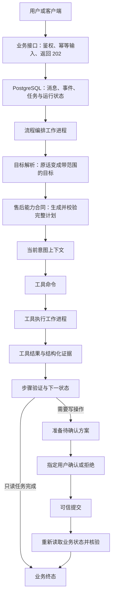
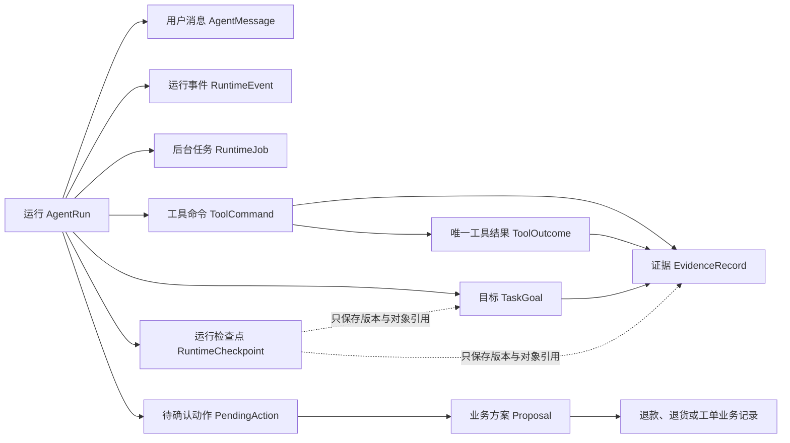
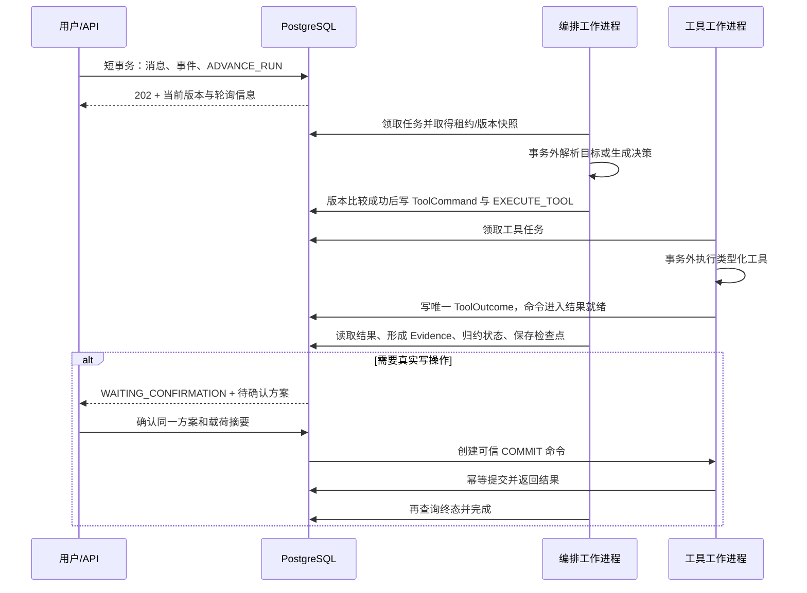
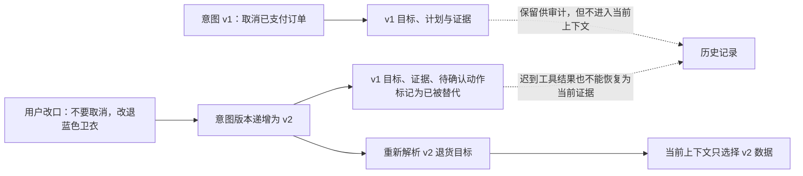

> 本文依据项目总结材料整理。案例、指标和验证记录沿用材料所述的冻结实验；本文发布过程没有重新运行售后系统实验。数据是已参与开发的工程回归集，结论限定在既定售后能力内。

## 1. 项目背景与能力边界

AfterPilot 是一个面向电商售后的持久化智能体。它支持订单定位、订单与物流查询、取消退款、退货退款、政策判断和人工转接，但不追求让大模型自由调用所有工具，而是把不确定性限制在一个可以持久化、检查、确认和恢复的执行闭环内。

这个项目真正要解决的不是“怎样让模型说出一段像客服的话”，而是下面这类工程问题：用户说要退蓝色卫衣时，系统能否找到正确订单中的正确商品；退款前能否拿到当前订单版本和服务端报价；用户确认的是否正是随后提交的方案；进程重启或任务重复投递时是否会重复退款；最后能否证明数据库中的退款、退货记录和订单状态确实满足要求。

因此，项目主线可以压缩成一句话：

> 把自然语言售后请求转换为带业务范围的结构化目标，再通过持久化计划、当前意图证据、可信用户确认、幂等提交和业务终态核验，完成可恢复且可审计的真实业务操作。

### 1.1 项目能做什么

- 根据订单号或商品描述定位订单；
- 查询订单状态、物流轨迹和售后政策；
- 取消未发货订单并原路退款；
- 对已送达订单中的指定商品发起退货退款；
- 在物流异常、政策不覆盖或请求超出能力时创建真实人工工单；
- 处理一条消息中的多个目标，以及用户中途改变需求；
- 在任务重复投递、确认竞争和工作进程异常后继续收敛到可解释状态。

### 1.2 项目刻意不做什么

- 不把自己包装成能够处理任意领域任务的通用智能体；
- 不让生产环境暴露自由选择 Direct、ReAct 或模型规划策略的入口；
- 不宣称金融意义上的全局“恰好一次”执行；
- 不宣称现有数据可以证明未见任务、跨数据集或跨领域泛化；
- 不为了展示技术名词而强行加入 Redis、Celery、复杂消息队列或退款 Saga。

## 2. 核心术语

| 中文称呼           | 必要的原名         | 在本项目中的含义                                                                         |
| ------------------ | ------------------ | ---------------------------------------------------------------------------------------- |
| 运行控制框架       | Harness            | 管理持久化状态、任务调度、租约、恢复、并发和检查点的通用框架，不负责判断什么订单可以退款 |
| 售后能力合同       | Capability         | 把售后目标、允许工具、证据要求、确认规则和完成条件写成可执行约束                         |
| 技能说明           | Skill / `SKILL.md` | 供人或模型理解能力边界的说明文档，不会被生产运行时动态解析成业务规则                     |
| 目标框架           | GoalFrame          | 从用户原话中得到的结构化目标，包含目标类型、订单/商品实体、置信度和原文位置              |
| 计划依赖图         | PlanGraph / DAG    | 持久化的完整执行计划，记录步骤及其前后依赖                                               |
| 证据               | Evidence           | 工具真实返回并经过归一化的结构化事实，带目标、意图版本和业务范围                         |
| 待执行方案         | Proposal           | 准备阶段生成的无业务副作用方案，记录动作范围、金额、版本和载荷摘要                       |
| 待确认动作         | PendingAction      | 已经准备好但尚未提交的退款或退货方案，绑定用户、方案和载荷摘要                           |
| 证据—执行—验证闭环 | PEV                | 先收集事实，再执行受控步骤，每一步都验证，提交后再核验业务终态                           |
| 模型上下文协议     | MCP                | 在这里主要是工具传输和平台集成边界，不是退款授权机制                                     |
| 稳定成功           | stable success     | 同一个评测案例连续三轮全部成功，才计为案例级成功                                         |

## 3. 总体架构：谁负责什么

本项目的核心不是某个提示词，而是职责分离。接口层只接收命令，运行控制框架推进状态，售后能力合同约束业务，工具层读取或改变真实数据，验证器判断证据是否足够，可信确认链路才有权提交写操作。



### 3.1 接口层：只接受命令，不同步跑完整智能体

系统对外提供五个业务接口：创建运行、追加消息、读取运行、确认方案和拒绝方案。五个接口都要求 Bearer 身份凭证，创建运行和追加消息还支持 `Idempotency-Key`，用于让客户端或网关重试收敛到同一输入。

创建运行、追加消息和确认方案返回 `202`，表示命令已经可靠落库并等待异步推进，而不是宣称业务已经完成。接口线程不会同步调用模型或业务工具，因此慢工具和模型超时不会长时间占住 HTTP 请求。

如果方案已经确认并进入提交阶段，用户又发送新消息，接口返回 `409 COMMIT_IN_PROGRESS`。这是有意设计的边界：提交可能已经产生不可安全撤回的业务效果，此时拒绝新意图比“先收下消息、以后再看能不能处理”更诚实。

### 3.2 运行控制框架：管理执行，不替领域做决定

运行控制框架可以理解为智能体的“操作系统”。它保存运行、消息、目标、事件、后台任务、工具命令、工具结果、证据、待确认动作和检查点，并负责下面这些通用问题：

- 哪个任务现在可以被领取；
- 工作进程崩溃后任务何时可以重新领取；
- 重复命令如何映射到同一稳定标识；
- 工具结果如何归约为下一运行状态；
- 用户改意后哪些旧数据不能再进入当前上下文；
- 同时确认和拒绝同一方案时哪个决定生效；
- 运行完成、等待用户、需要人工或失败时如何留下可审计状态。

运行控制框架不判断“已发货订单能不能取消”或“蓝色卫衣是否属于这个订单”。这些属于售后能力合同和工具服务的职责。这个边界让运行时可以保持通用，而售后规则可以独立演进。

### 3.3 售后能力合同与 `SKILL.md` 的区别

项目中真正约束生产执行的是可运行的售后能力合同。它定义支持的目标类型、每种目标的固定计划骨架、允许调用的工具、工具权限、所需证据、人工转接条件和业务终态。

`SKILL.md` 更像一份供人或模型阅读的能力说明：它帮助模型评测或开发者理解“先查订单、再报价、再准备方案、再确认”的工作方式，但生产运行时不会读取这份 Markdown 后临时生成权限规则。即使说明文档写错，代码中的能力合同、工具注册表和验证逻辑仍是最终执行边界。

技能说明用于描述能力边界，能力合同则把目标、工具权限和完成条件落实为可执行约束。

### 3.4 目标、计划和验证器

目标解析器先把一条用户消息拆成一个或多个目标。每个目标不仅有“取消退款”这样的类型，还保存订单号、商品颜色、商品描述、置信度和它来自原话的哪一段。这样后续出现错误订单号时，可以追溯到底是用户说错、解析错还是工具返回错。

售后能力合同根据目标生成完整计划依赖图。取消退款的主链是“读取订单 → 获取服务端报价 → 准备方案 → 等待可信决定 → 提交 → 查询售后终态”；退货退款还会在报价前增加“在指定订单中解析商品”。

验证器不根据一段自然语言判断“看起来差不多完成了”，而是检查当前步骤的结构化条件。例如报价必须显示允许操作并带回订单版本和金额；退货商品必须来自指定订单中的唯一解析结果；最终取消退款必须同时看到退款成功、订单已取消、版本正确增加且没有错误退货记录。

### 3.5 工具层和 MCP 的信任边界

工具权限实际分为只读、准备、能力控制写入和可信提交。模型可见集合只有读取订单、解析商品、查询物流、查询政策、获取报价和准备方案；物流异常或能力外请求所需的人工工单由售后能力合同创建，不由模型任意触发；确认和退款提交则只来自可信决定链路。

项目保留内部可信 MCP 服务，用于承载确认或拒绝等受信动作；普通 MCP 服务只暴露读取和准备能力。生产 Compose 中可信服务只在容器内部网络可见，不映射到宿主机公网，评测桥接也只绑定 `127.0.0.1`。

必须强调：MCP 只是调用工具的一种传输方式，不会自动让调用者获得退款权限。真正授权仍来自 Bearer 身份、用户与方案绑定、载荷摘要校验、状态锁和服务端业务校验。

### 3.6 为什么 PostgreSQL 是唯一协调存储

当前项目是单一售后服务，任务、业务状态和确认状态都需要事务一致性。PostgreSQL 已能提供持久化任务表、唯一约束、行锁、比较并交换、租约和 outbox 风格事件，因此继续引入 Redis 或 Celery 会增加第二套一致性边界，却没有明确收益。

这里不是说消息队列没有价值，而是按当前规模做了克制选择。当吞吐需要独立扩缩容、任务积压治理变复杂或跨服务事件明显增加时，再把任务投递拆到专门队列会更合理。

### 3.7 系统内部到底保存了哪些对象

如果只画“接口→规划器→工具”的流程图，仍然看不出系统为什么能够恢复。本项目的关键是把一次智能体运行拆成多类持久对象，每类对象只承担一种事实责任。



| 对象       | 保存的核心事实                                       | 为什么不能只放内存                             |
| ---------- | ---------------------------------------------------- | ---------------------------------------------- |
| 运行       | 当前状态、策略与能力版本、四种版本号、预算、终态摘要 | 工作进程重启后需要知道任务进行到哪一步         |
| 消息       | 用户原话与来源                                       | 目标需要能够追溯到输入，审计时不能只看解析结果 |
| 目标       | 类型、实体、置信度、原文位置、缺失实体、意图版本     | 多目标任务必须保持订单和商品归属               |
| 运行事件   | 递增序号、事件类型、来源、摘要和幂等键               | 用于解释状态为什么变化，并阻止同一输入重复记账 |
| 后台任务   | 任务类型、去重键、可执行时间、租约、投递次数         | API 与慢执行解耦，崩溃后可以重新领取           |
| 工具命令   | 稳定命令标识、目标、节点、参数摘要、权限、计划版本   | 重试时必须知道“是不是同一个业务动作”           |
| 工具结果   | 每个命令唯一的成功/失败结果、输出摘要、错误码        | 结果可以先落库，再由编排进程异步归约           |
| 证据       | 来源命令、来源结果、业务范围、观察版本、事实、新鲜度 | 计划后续参数和完成判断必须有可信来源           |
| 待确认动作 | 用户、目标、业务方案、载荷摘要、业务版本和过期时间   | 用户确认必须精确绑定将要提交的内容             |
| 检查点     | 运行/意图版本、事件序号、对象引用、预算和策略状态    | 恢复时重新读取规范对象，避免复制过期大对象     |

这里有一个重要原则：消息、命令、结果和证据各自保留，不能把它们压成一段“对话历史”。消息说明用户说过什么，命令说明系统准备做什么，结果说明工具返回什么，证据说明哪些返回值被当前目标接受为事实。

### 3.8 四种版本号分别防什么问题

运行对象同时保存多个版本号，它们不是重复字段，而是解决不同一致性问题。

| 版本                            | 何时变化                       | 主要用途                               | 典型拒绝场景                                       |
| ------------------------------- | ------------------------------ | -------------------------------------- | -------------------------------------------------- |
| 运行版本 `run_version`          | 运行状态发生需要并发保护的变化 | 判断工作进程拿到的运行快照是否仍然有效 | 工作进程计算期间，另一请求已经确认方案或修改状态   |
| 意图版本 `intent_version`       | 用户接受的新消息替换当前需求   | 隔离旧目标、旧证据、旧任务和迟到结果   | 用户已经从“取消订单”改成“退指定商品”，旧查询才返回 |
| 计划版本 `plan_version`         | 当前意图生成或替换执行计划     | 区分不同计划中的同名节点和命令         | 计划已经被替换，旧计划节点仍尝试创建命令           |
| 检查点版本 `checkpoint_version` | 每次有效推进保存新检查点       | 标识运行推进位置并形成可恢复历史       | 进程重启后需要确定最后一次已归约的步骤             |

此外，每次编排任务被领取时还生成一次执行令牌，后台任务自身也有租约令牌。运行版本、意图版本、执行令牌和任务租约令牌必须同时匹配，计算结果才允许写回。这相当于在数据库事务之间做一次比较并交换，而不是默认“先读取的人最后一定有权写入”。

### 3.9 一次请求怎样跨越 API、编排进程和工具进程

下面以创建运行后的第一次推进为例说明真实事务边界。

1. API 在一个短事务中验证用户身份和幂等键，写入运行、用户消息、运行事件和一条 `ADVANCE_RUN` 后台任务，然后返回 `202`。
2. 编排工作进程使用行锁和 `SKIP LOCKED` 领取一条到期任务，把它标记为运行中，写入 90 秒租约和唯一租约令牌，同时锁定运行并取得运行版本、意图版本和执行令牌。
3. 领取事务提交后，进程才在数据库事务之外执行目标解析或规划。这避免模型调用占用长数据库事务。
4. 解析或规划结束后，进程重新开启短事务，锁定任务与运行，并比较任务状态、租约令牌、运行版本、意图版本和执行令牌。任一字段变化都说明快照已过期，结果被丢弃或任务被标记为已替代。
5. 如果得到工具调用指令，能力合同先校验工具、权限、目标和证据，再生成稳定工具命令；同一事务写入工具命令、`EXECUTE_TOOL` 任务和运行事件，运行进入等待工具状态。
6. 工具工作进程领取执行任务，在事务外调用业务工具，再把唯一工具结果落库，并把命令标记为结果已就绪。
7. 编排工作进程再次领取推进任务，读取工具结果，形成证据，验证当前节点，更新目标或待确认动作，保存检查点，然后决定创建下一条工具任务、等待用户、等待确认、转人工或结束。



这里最关键的不是“用了两个工作进程”，而是慢计算与数据库事务分离，并且写回前重新验证快照。否则用户改意、任务超时重领或并发确认发生时，旧模型输出仍可能覆盖新状态。

### 3.10 命令—结果—证据为什么要分成三层

工具命令标识不是随机调用编号，而是由运行标识、意图版本、计划版本、节点标识和命令代次计算稳定摘要。相同计划节点和代次会得到同一个命令身份；参数另外计算规范化摘要，用于判断同一个节点是否试图换一组参数重做。

```text
command_id = SHA256(run_id, intent_version, plan_version, node_id, generation)
arguments_hash = SHA256(按键排序并规范化后的工具参数)
provider_idempotency_key = command_id
```

工具结果表对 `command_id` 有唯一约束，因此同一命令最多有一个规范结果。工具工作进程可以重复投递，但不能为同一命令插入两份相互矛盾的结果。

结果也不会直接等于证据。售后能力合同先解释结果，抽取允许进入后续流程的事实和业务范围，再写证据。例如订单工具可能返回完整订单，当前步骤只把订单标识、状态和版本作为目标证据；商品解析工具则把唯一解析出的商品集合保存为证据。这个转换减少了后续规划器接触无关数据的机会。

命令典型状态可以概括为：

```text
PENDING → 工具任务执行 → OUTCOME_READY → 编排归约 → REDUCED
```

如果结果已经归约，重复推进不会再次消费它；如果结果已落库但编排进程崩溃，下一次推进仍能发现 `OUTCOME_READY` 并继续归约。

### 3.11 计划合同不只是“工具顺序列表”

一个计划步骤会保存所属目标、订单范围、节点类型、工具、动作类型、依赖节点、必需输入、预期输出字段、完成条件、失败策略、状态和证据引用。节点类型除了普通工具，还有可信决定和可信提交，意味着用户确认与真实写入是计划图中的显式门，而不是提示词中的一句提醒。

计划保存后会执行结构校验：

- 每个目标和步骤标识必须唯一；
- 每个步骤必须属于一个已声明目标；
- 依赖必须指向前面已存在的节点，不能出现缺失依赖或向前引用；
- 跨目标依赖必须在目标层显式声明，不能偷偷借用另一个目标的步骤；
- 取消退款必须存在且只存在一条完整主链；
- 退货退款必须在报价前额外包含商品解析；
- 只有所有依赖完成或失效后，节点才成为下一可执行步骤。

可以把受控决策过程理解为下面的伪代码：

```text
读取当前意图的目标、证据和检查点
如果没有目标：解析最新用户消息
否则：
    取依赖均已满足的第一个待执行节点
    从目标实体和当前证据物化工具参数
    由能力合同校验工具、权限、订单范围和报价资格
    创建稳定工具命令
工具结果返回后：
    校验实际工具与计划工具一致
    校验参数范围、输出范围和预期字段
    通过则保存证据并完成节点
    不通过则按 ASK_USER / REPLAN / ESCALATE / FAIL 处理
```

“物化工具参数”是安全重点：订单号首先来自当前目标，商品标识来自当前目标下的商品解析证据，金额和订单版本来自服务端报价，方案标识来自准备结果。计划或模型只能表达要完成哪个节点，不能自由创造这些高风险参数。

### 3.12 状态机怎样表达等待、人工和失败

运行状态不是只有“进行中/已完成”，而是区分以下语义：

| 状态                   | 含义                                   | 谁能让它继续               |
| ---------------------- | -------------------------------------- | -------------------------- |
| `QUEUED`               | 已有下一步推进任务                     | 编排工作进程               |
| `RUNNING`              | 某个编排快照正在计算                   | 持有匹配执行令牌的编排任务 |
| `WAITING_TOOL`         | 已创建工具命令，等待规范结果           | 工具工作进程和后续归约任务 |
| `WAITING_USER`         | 缺少实体或需要澄清                     | 用户追加消息               |
| `WAITING_CONFIRMATION` | 无副作用方案已准备好                   | 绑定用户确认或拒绝         |
| `COMPLETED`            | 所有目标的业务后置条件已验证           | 终态，不再自动推进         |
| `NEEDS_HUMAN`          | 能力外请求、物流冲突或业务异常需要人工 | 人工系统或后续外部流程     |
| `FAILED`               | 不可恢复的合同、运行时或预算失败       | 终态，需要诊断或新运行     |

典型主路径是 `QUEUED → RUNNING → WAITING_TOOL → QUEUED` 循环多次，写目标到达 `WAITING_CONFIRMATION` 后等待外部决定，提交与终态查询完成后进入 `COMPLETED`。信息不足走向 `WAITING_USER`，物流冲突或明确能力外请求可能走向 `NEEDS_HUMAN`。

### 3.13 发生故障时从哪里恢复

| 故障位置                     | 数据库中已经有什么           | 恢复方式                                   | 为什么不会重复业务效果                 |
| ---------------------------- | ---------------------------- | ------------------------------------------ | -------------------------------------- |
| API 返回 202 前连接断开      | 运行、消息和任务可能已经提交 | 客户端用同一幂等键重试并读取已有运行       | 创建运行和消息有去重约束               |
| 编排计算期间用户改意         | 旧任务租约和旧运行快照       | 写回时意图版本或运行版本不匹配，旧结果作废 | 比较并交换拒绝迟到快照                 |
| 工具命令已创建，任务重复投递 | 稳定命令和唯一去重键         | 复用已有工具命令或任务                     | 命令身份和任务去重键不变               |
| 工具已执行，结果尚未归约     | 唯一工具结果、命令为结果就绪 | 后续编排任务重新读取并归约                 | 结果按命令唯一，已归约后不会再次消费   |
| 方案已创建，结果写入前崩溃   | 业务方案已经存在             | 以来源命令幂等键查回原方案                 | 同键同载荷返回已有方案，同键异载荷冲突 |
| 支付调用超时，提交任务重试   | 稳定支付方幂等键             | 再次请求支付方并读取同一结果               | 外部请求键与方案和载荷绑定             |
| 确认与拒绝并发               | 同一个待确认动作             | 行锁和状态转换只接受第一个合法决定         | 后续决定看到状态已变化                 |

检查点不会复制完整消息和工具载荷，而是保存版本、事件序号、预算、策略状态以及当前目标/证据/待确认动作的引用。恢复时重新读取规范表，避免“检查点里一份旧订单、证据表里又一份新订单”的双重事实源。

## 4. 一个真实案例如何在系统中变化

下面使用冻结评测中的 `evaluation-v5-cancel_refund-045`。这条案例同时包含取消退款和指定商品退货，能够把目标拆分、跨目标依赖、证据绑定、用户确认和终态变化放在同一条链路中说明。

### 4.1 用户输入和初始业务数据

用户的核心诉求是：取消订单 `ORD-V3-045-PAID` 并原路退款；同时退回订单 `ORD-V3-045-RETURN` 中的蓝色云感卫衣并原路退款。

夹具中的关键初始状态如下：

| 对象       | 初始状态            | 关键内容                                 |
| ---------- | ------------------- | ---------------------------------------- |
| 待取消订单 | `PAID / v1`         | 灰色旅行背包，支付 12,900 分，支付宝     |
| 待退货订单 | `DELIVERED / v1`    | 蓝色云感卫衣 7,900 分、灰色同款 5,000 分 |
| 蓝色卫衣   | 未退货、商品版本 v1 | 用户明确要求退回                         |
| 灰色卫衣   | 未退货、商品版本 v1 | 用户没有要求退回，必须保持不变           |

这个初始数据很重要，因为评测不是只看最后一句回复，而是会检查订单状态、版本、退款账本、退货记录和精确商品范围。

### 4.2 原始消息变成两个目标

解析器把复合句拆成两个独立目标：

| 目标   | 类型     | 绑定范围                              | 来自原话的信息     |
| ------ | -------- | ------------------------------------- | ------------------ |
| 目标 1 | 取消退款 | `ORD-V3-045-PAID`                     | 取消并原路退款     |
| 目标 2 | 退货退款 | `ORD-V3-045-RETURN` + 蓝色 + 云感卫衣 | 只退指定颜色和商品 |

两个目标都有自己的原文位置和业务范围。计划不能把目标 1 的订单证据拿给目标 2 使用，也不能因为两个订单同时出现在上下文中就让模型自行猜测商品属于哪个订单。

### 4.3 两个写目标如何形成完整计划

取消退款目标形成六类步骤：读取订单、获取取消报价、准备取消方案、等待用户确认、可信提交、终态复查。

退货退款目标形成七类步骤：读取订单、在该订单内唯一解析蓝色云感卫衣、获取退货报价、准备退货方案、等待用户确认、可信提交、终态复查。

项目把两个写目标串行起来：先完整完成取消退款并验证终态，再开始退货目标。原因不是数据库不能并发，而是多个高风险写操作如果并行准备和确认，会增加用户看到多个方案、订单版本变化和副作用归属混乱的概率。当前业务规模下，串行换来了更清晰的授权与恢复语义。

### 4.4 工具结果如何逐步变成证据

| 阶段         | 工具返回的关键事实                             | 系统如何使用                                 |
| ------------ | ---------------------------------------------- | -------------------------------------------- |
| 读取取消订单 | 订单为 `PAID`，版本 1                          | 证明订单范围和当前状态正确                   |
| 获取取消报价 | 允许取消，金额 12,900 分，订单版本 1           | 金额和预期版本必须来自服务端，不能由模型填写 |
| 准备取消方案 | 状态为等待确认，生成方案标识和载荷摘要         | 保存用户即将确认的准确内容，不产生真实退款   |
| 提交取消方案 | 退款成功，订单版本变为 2                       | 形成提交证据，但仍不直接宣告任务完成         |
| 复查取消终态 | 订单 `CANCELLED`，退款记录成功，无退货记录     | 满足取消退款的业务后置条件                   |
| 读取退货订单 | 订单为 `DELIVERED`，版本 1                     | 证明该订单可进入商品解析                     |
| 解析退货商品 | 只解析到蓝色卫衣对应的商品标识                 | 把自然语言商品描述变成精确业务范围           |
| 获取退货报价 | 允许退货，金额 7,900 分，订单版本 1            | 报价范围必须与解析出的商品完全一致           |
| 准备退货方案 | 等待确认，载荷包含订单和唯一商品标识           | 防止确认后偷偷替换商品范围                   |
| 提交并复查   | 退款和退货记录成功，蓝色商品已退，灰色商品未退 | 证明真实业务状态与用户要求一致               |

每条证据都带目标标识、意图版本、工具名称和业务范围。后续参数从这些结构化事实中生成，而不是让模型在长对话中复制订单号、金额或商品标识。

### 4.5 为什么“准备方案”与“真实提交”必须分开

准备阶段只创建一个无真实业务副作用的待执行方案（Proposal）。它记录动作类型、订单、商品范围、订单预期版本、金额、用户身份和载荷摘要，然后进入等待确认状态。

用户确认时必须同时匹配用户身份、方案标识和载荷摘要。只知道方案标识不够，旧页面或被篡改页面提交的摘要也不能确认新方案。确认与拒绝通过数据库锁和状态转换竞争，同一个待确认动作最终只能接受一个可信决定。

真实提交使用稳定幂等键。即使提交任务因为超时被重复投递，支付方请求、退款记录和退货记录也会收敛到同一个业务效果，而不是再创建一笔退款。

### 4.6 最终业务数据发生了什么变化

| 对象                | 执行前           | 执行后             | 结论                         |
| ------------------- | ---------------- | ------------------ | ---------------------------- |
| `ORD-V3-045-PAID`   | `PAID / v1`      | `CANCELLED / v2`   | 取消成功                     |
| 取消退款账本        | 不存在           | 成功退款 12,900 分 | 原路退回支付宝               |
| `ORD-V3-045-RETURN` | `DELIVERED / v1` | `DELIVERED / v2`   | 部分退货不把整个订单改成取消 |
| 蓝色云感卫衣        | 未退货 / v1      | 已退货 / v2        | 精确命中用户请求             |
| 灰色云感卫衣        | 未退货 / v1      | 未退货 / v1        | 未误伤同订单同款商品         |
| 退货退款账本        | 不存在           | 成功退款 7,900 分  | 金额与蓝色商品一致           |

这条运行一共产生三个业务副作用：两笔退款和一条退货记录；重复副作用为零。完整执行调用 11 次工具，两个目标最终均为完成状态，运行状态为 `COMPLETED`。

## 5. 上下文与用户改意：为什么完整历史不等于当前事实

长期运行的智能体不能把所有历史消息和工具结果不加区分地塞给规划器。旧订单号、旧商品标识或旧方案标识一旦被重新使用，就可能产生跨意图污染。

本项目为每轮有效用户意图维护版本。当前上下文只包含当前版本的目标、仍然新鲜的证据、当前待确认动作、最新用户变化和剩余预算。完整消息、事件、命令和工具结果仍保留在数据库中用于审计与恢复，但不会因为“历史上出现过”就自动成为当前规划依据。



冻结案例 `evaluation-v5-user_change-105` 展示了这个过程。用户最初要求取消 `ORD-V3-105-PAID`，随后明确说不再取消，改为退 `ORD-V3-105-RETURN` 中的蓝色云感卫衣。

系统把意图版本从 1 提升到 2，最终当前目标只剩退货退款。运行结束时，原本准备取消的已支付订单仍为 `PAID`，蓝色卫衣完成退货并退款 7,900 分，灰色同款保持未退货。最终只有一笔退款和一条退货记录，没有产生旧取消意图的副作用。

如果用户改意发生在方案已经批准或正在提交时，系统不会继续递增意图，而是返回 `409 COMMIT_IN_PROGRESS`。因为此时旧操作可能已经进入不可安全撤销的外部支付过程，继续接受新要求会制造无法兑现的语义。

## 6. 边界场景与运行取舍

### 6.1 缺少实体时先澄清

解析器把“两个订单都取消”展开为两个分别绑定订单的目标。“最近送达”只是订单描述；只有用户明确询问物流、到货时间或单号，才生成物流目标。解析器会检查用户可见范围，但最终授权仍由能力合同和工具服务决定。

压力案例 `evaluation-v5-stress-missing_entity-00` 的用户消息没有订单号或商品信息。标准答案要求进入 `WAITING_USER`，不调用准备、确认、拒绝或创建工单等写相关工具，业务副作用为零。

### 6.2 至少一次交付与幂等效果

后台任务使用固定 90 秒租约，异常退出后可重新领取。当前模型与工具的超时上界已知，因此尚未引入心跳续租。命令、方案和支付请求使用稳定幂等键：同键同载荷返回已有结果，同键异载荷则冲突。这保证重复交付收敛为同一业务效果，不构成数据库与外部支付之间的全局恰好一次保证。

### 6.3 异常隔离与支付边界

工具工作进程捕获未预期异常，保存可诊断的失败状态后继续处理后续任务。并发创建同一运行或任务触发唯一约束时，读取已有记录使请求收敛。

支付调用目前仍位于最长约 5 秒的数据库事务内，以降低实现复杂度。项目尚未实现多阶段退款状态机、后台对账和补偿事务，因此当前设计不是完整支付 Saga；长事务和外部支付不确定性仍是明确限制。

## 7. 数据集设计：原数据是什么，当前数据如何得到

### 7.1 数据集的用途

`evaluation/cases.jsonl` 是面向本项目售后能力的合成工程回归集。它的目的不是复现某个公开榜单，而是用可执行的本地订单夹具和严格标准答案验证：目标是否正确、工具顺序是否合理、证据是否属于正确范围、用户确认是否正确、最终数据库状态是否符合业务要求。

每条当前案例都带来源数据集、上游任务编号、固定提交、来源摘要、许可证和来源哈希。这个溯源信息说明“案例受到哪个公开任务启发”，不表示当前消息是原任务的逐句翻译。

### 7.2 ECom-Bench 原任务是什么样

[ECom-Bench 固定提交任务文件](https://github.com/XiaoduoAILab/ECom-Bench/blob/bc5018daaf45eea12330941bce68cebd293cfa85/envs/story/tasks.py) 中的任务是 Python 对象，包含标注者、用户、店铺、平台、较长的用户画像和多段目标，还包含期望动作与查询参数。

原文件中的单条任务大致按下面的真实字段结构保存。代码块保留了任务对象和实际字段名，长指令与动作数组用省略号隐藏，避免把第三方整条记录复制进本文：

```python
Task(
    annotator='1',
    user_id="cnjd喜哥2号",
    shop_id="5de650c946e7c3001814990f",
    platform="jd",
    instruction="""用户画像、多段意图与条件关系……""",
    metadata=Validation(
        outputs=[],
        actions=[Action(...)],
        searches=[Search(...)],
    ),
)
```

这说明上游任务不是简单的“用户问句 + 答案”，而是同时包含对话角色、长指令、预期业务动作和查询轨迹。本项目不能只复制 `instruction`，还要决定哪些意图属于当前售后能力，以及怎样为这些意图构造本地订单状态和可验证终态。

当前案例引用的任务 0 是一个多意图电商客服任务，核心内容包括：用户抱怨商品安装麻烦并询问教程；要求查询一笔订单的物流并加急；查询另一笔订单状态，如果未发货则取消；查询第三笔订单是否有返现记录，如果没有则验证图片并登记返现。参考动作包括物流加急、取消订单和返现登记。

这个原任务覆盖的能力比本项目更宽，包含安装教程、加急和返现。当前项目没有假装支持这些能力，而是提取其中与“多目标、订单查询、物流、取消和异常转接”有关的结构，再用本地售后能力重新组合。

### 7.3 零售任务原数据是什么样

[零售任务固定提交文件](https://github.com/sierra-research/tau2-bench/blob/fc0055dc4e0a316c3f83133267fbd6faaa770992/data/tau2/domains/retail/tasks.json) 中的记录是结构化 JSON，主要包括任务编号、用户场景、任务说明、领域、来电原因、已知/未知身份信息、初始状态，以及由参考动作、需要沟通的信息、自然语言断言和评分依据组成的评价条件。

固定文件中一条零售任务的真实字段层级如下。这里展示字段结构并省略长值；当前案例记录中的 `source.task_shape` 则保留了所选任务的内容摘要。

```json
{
  "id": "30",
  "description": {
    "purpose": null,
    "relevant_policies": null,
    "notes": null
  },
  "user_scenario": {
    "persona": null,
    "instructions": {
      "task_instructions": "……",
      "domain": "retail",
      "reason_for_call": "……",
      "known_info": "……",
      "unknown_info": "……"
    }
  },
  "initial_state": null,
  "evaluation_criteria": {
    "actions": ["……"],
    "communicate_info": [],
    "nl_assertions": null,
    "reward_basis": ["DB", "NL_ASSERTION"]
  }
}
```

当前主案例引用的上游任务 30 描述了一组相互关联的诉求：用户收到损坏的平板，先想知道物流单号，再希望换货或退货；如果平板被退回，还要取消配套充电器；最后再退一双运动鞋。参考动作包含身份和订单查询、商品查询、退回已送达商品以及取消待处理订单。

这个任务的价值在于“多个售后动作之间存在条件依赖”，而不是平板或运动鞋这些具体商品。当前案例保留了复合退货与取消的结构，但把实体和动作改写成本项目能完整验证的取消退款与指定商品退货。

### 7.4 从上游任务到当前案例的转换链


这条链路不是自动逐字翻译，而是“能力投影 + 场景重组 + 可执行标注”。当前仓库保存了链路末端的案例和来源信息，但没有保留当时每一步人工或脚本转换日志。

### 7.5 主案例的“保留、改写、舍弃、新增”

| 转换类型 | 上游零售任务 30                        | 当前 `cancel_refund-045`                   | 原因                                         |
| -------- | -------------------------------------- | ------------------------------------------ | -------------------------------------------- |
| 保留     | 同一用户一次提出多个相互关联的售后动作 | 一次提出取消订单和退指定商品               | 保留复合任务与跨目标依赖                     |
| 保留     | 退货前需要读取订单和商品信息           | 先查订单，再在订单内解析蓝色卫衣           | 保留基于事实确定业务范围的结构               |
| 改写     | 平板、充电器、运动鞋和原始订单号       | 旅行背包、蓝/灰云感卫衣和本地订单号        | 与本地固定夹具和工具合同对齐                 |
| 改写     | 换货不可用时退货，并取消配套商品       | 取消已支付订单，再退已送达订单中的指定商品 | 投影到项目实际支持的取消退款和退货退款能力   |
| 舍弃     | 平板物流单号和换货选择                 | 不在该案例中保留                           | 避免混入当前主案例无法完整评价的换货能力     |
| 新增     | 上游参考动作和评分条件                 | 本地目标、计划依赖、证据、确认和终态       | 让案例能够直接运行并检查数据库后置条件       |
| 新增     | 上游状态不直接适配本地服务             | 四类本地订单、商品版本、金额和支付方式     | 为错误订单、错误商品和版本冲突提供可检验环境 |

### 7.6 ECom-Bench 任务 0 到当前案例 000

`evaluation-v5-order_resolution-000` 引用 ECom-Bench 任务 0。原任务包含安装、物流加急、订单状态与取消、返现验证等八段意图；当前案例把它重组为三个项目内目标：按“黑色轻量夹克”定位订单、取消一个已支付订单、查询一个物流异常订单。

原任务中的安装和返现能力被舍弃，原始订单号被替换为本地订单号，并新增四种状态的订单夹具、三个目标的来源范围、所需工具、物流异常人工工单和终态断言。这个例子进一步说明当前数据是“来源启发”，不是一一翻译。

### 7.7 一条当前案例内部有哪些数据

为了让评测既能运行又能解释，每条记录包含五组核心信息：

| 数据组   | 具体内容                                           | 在流程中的作用                   |
| -------- | -------------------------------------------------- | -------------------------------- |
| 用户消息 | 初始消息、后续改意、可选历史                       | 输入目标解析和上下文构建         |
| 业务夹具 | 用户、租户、订单、商品和初始状态                   | 在隔离数据库中构造可执行场景     |
| 标准目标 | 目标类型、实体、原文范围、依赖                     | 判断解析与计划是否正确           |
| 执行标准 | 允许、必需、禁用工具，所需证据和可信决定           | 判断工具、范围、证据与确认链路   |
| 终态标准 | 运行状态、订单状态、方案状态、工单要求和副作用上限 | 判断真实业务结果，而不是只看文本 |

来源字段另外保存数据集名称、任务编号、固定提交和任务摘要；`derived_from` 表示压力案例来自哪条基础案例；暴露标记用于阻止把已经用于开发的数据误写成未见测试集。

### 7.8 `cases.jsonl` 中真实的一行长什么样

`evaluation/cases.jsonl` 每个物理行是一条完整 JSON。下面不是重新编造的示例，而是把 `evaluation-v5-cancel_refund-045` 这一行解析后，对真实字段做了可读性投影；键和值保持不变，只省略了本节未讲解的另外两类订单、历史消息和部分允许工具。

先看用户输入和初始业务夹具：

```json
{
  "id": "evaluation-v5-cancel_refund-045",
  "split": "benchmark",
  "family": "cancel_refund",
  "messages": {
    "initial": "请先收集必要事实，再处理以下事项：在当前售后账户中，订单 ORD-V3-045-PAID 地址无法修改，请取消并原路退款。同时取消订单 ORD-V3-045-PAID 并按原路退款；同时退回订单 ORD-V3-045-RETURN 中的蓝色云感卫衣并按原路退款。",
    "followups": []
  },
  "fixture": {
    "actor_id": "user-eval",
    "orders": {
      "paid": {
        "items": [
          {
            "color": "灰色",
            "item_id": "ITEM-ORD-V3-045-PAID-1",
            "product_name": "旅行背包"
          }
        ],
        "order_id": "ORD-V3-045-PAID",
        "status": "PAID",
        "version": 1
      },
      "return": {
        "items": [
          {
            "color": "蓝色",
            "item_id": "ITEM-ORD-V3-045-RETURN-1",
            "product_name": "云感卫衣"
          },
          {
            "color": "灰色",
            "item_id": "ITEM-ORD-V3-045-RETURN-2",
            "product_name": "云感卫衣"
          }
        ],
        "order_id": "ORD-V3-045-RETURN",
        "status": "DELIVERED",
        "version": 1
      }
    }
  }
}
```

这段原始字段直接定义了评测的输入世界：同一条消息出现两个订单；待取消订单是已支付状态；待退货订单中有两件同名但颜色不同的商品。只要系统退错颜色，即使回复文字正确也会在终态评分中失败。

同一行中的标准目标片段如下：

```json
{
  "goal_frames": [
    {
      "clarification_required": false,
      "confidence": 1.0,
      "entities": {
        "order_id": "ORD-V3-045-PAID"
      },
      "goal_id": "goal-045-1",
      "goal_type": "CANCEL_REFUND",
      "missing_entities": [],
      "source_span": {
        "clause_index": 0,
        "end": 60,
        "start": 0,
        "text": "请先收集必要事实，再处理以下事项：在当前售后账户中，订单 ORD-V3-045-PAID 地址无法修改，请取消并原路退款"
      }
    },
    {
      "clarification_required": false,
      "confidence": 1.0,
      "entities": {
        "color": "蓝色",
        "description_query": "云感卫衣",
        "order_id": "ORD-V3-045-RETURN"
      },
      "goal_id": "goal-045-2",
      "goal_type": "RETURN_REFUND",
      "missing_entities": [],
      "source_span": {
        "clause_index": 2,
        "end": 130,
        "start": 91,
        "text": "同时退回订单 ORD-V3-045-RETURN 中的蓝色云感卫衣并按原路退款"
      }
    }
  ]
}
```

这里可以具体看到“目标与原话绑定”不是一句设计口号：`source_span` 保存字符起止位置和原文，`entities` 保存后续计划可用的订单、颜色和商品描述，`missing_entities` 与 `clarification_required` 决定是否允许继续规划。

同一行的执行标准和终态片段如下：

```json
{
  "dependency_edges": [
    ["aftersale_quote", "proposal_prepare"],
    ["proposal_prepare", "proposal_confirm"],
    ["proposal_confirm", "aftersale_status_get"],
    ["item_resolve", "aftersale_quote"]
  ],
  "required_tools": [
    "order_get",
    "aftersale_quote",
    "proposal_prepare",
    "proposal_confirm",
    "aftersale_status_get",
    "item_resolve"
  ],
  "pending_actions": [
    {
      "action_type": "CANCEL_REFUND",
      "actor_bound": true,
      "decision": "CONFIRM",
      "final_status": "COMMITTED",
      "goal_id": "goal-045-1",
      "item_ids": [],
      "order_id": "ORD-V3-045-PAID",
      "payload_hash_bound": true
    },
    {
      "action_type": "RETURN_REFUND",
      "actor_bound": true,
      "decision": "CONFIRM",
      "final_status": "COMMITTED",
      "goal_id": "goal-045-2",
      "item_ids": ["ITEM-ORD-V3-045-RETURN-1"],
      "order_id": "ORD-V3-045-RETURN",
      "payload_hash_bound": true
    }
  ],
  "terminal": {
    "max_business_side_effects": 3,
    "order_states": {
      "ORD-V3-045-PAID": "CANCELLED",
      "ORD-V3-045-RETURN": "DELIVERED"
    },
    "proposal_statuses": ["SUCCEEDED", "SUCCEEDED"],
    "run_status": "COMPLETED",
    "ticket_required": false
  }
}
```

这个片段说明评分不依赖某一条固定工具轨迹：`required_tools` 约束必要能力，`dependency_edges` 约束关键先后关系，`pending_actions` 约束用户确认和精确商品范围，`terminal` 则约束最终订单、方案、工单和副作用数量。

来源字段也在同一行中：

```json
{
  "source": {
    "dataset": "tau3-retail-v1.0.1",
    "task_id": "30",
    "commit": "fc0055dc4e0a316c3f83133267fbd6faaa770992"
  },
  "license": "MIT",
  "source_hash": "13c34c89b0d2643f592571931351eb8db194a8728ba151552bc9d3e0b20ed703",
  "derived_from": null,
  "exposure": "HISTORICALLY_EXPOSED"
}
```

`source` 回答“受哪条公开任务启发”，`source_hash` 用于发现来源摘要被无意修改，`derived_from` 区分基础案例和派生压力案例，`exposure` 明确阻止把这条数据声称为未见任务。

### 7.9 冻结结果中的真实执行轨迹

数据集定义“应该发生什么”，`evaluation/results.jsonl.gz` 保存“某次冻结运行实际发生了什么”。下面是主案例受控方案第 1 轮的一段真实轨迹投影，保留原序号、事件类型、节点和命令标识：

```json
[
  {
    "sequence": 4,
    "type": "DAG_NODE_DISPATCHED",
    "payload": {
      "step_id": "order_get_g1",
      "tool_name": "order_get",
      "depends_on": []
    }
  },
  {
    "sequence": 5,
    "type": "TOOL_COMMAND_CREATED",
    "payload": {
      "node_id": "pev:1:order_get_g1",
      "command_id": "sha256:4adf209844d65c9f22a2a991f14f5c8301c789113346d019bf18fc22a9ea2eb9",
      "permission": "READ",
      "arguments_hash": "sha256:a975f189cbb25be4fb2f6c102d7f02e4823156f4f0dc57735d68209377e5ed3e"
    }
  },
  {
    "sequence": 6,
    "type": "TOOL_SUCCEEDED",
    "payload": {
      "command_id": "sha256:4adf209844d65c9f22a2a991f14f5c8301c789113346d019bf18fc22a9ea2eb9",
      "error_code": null,
      "output_hash": "sha256:414abed53a2a711be4b8daac3d27876de30264141a2c17a3804bb46640921137"
    }
  },
  {
    "sequence": 7,
    "type": "VERIFICATION",
    "payload": {
      "step_id": "order_get_g1",
      "verdict": "PASS",
      "reason_code": "COMPLETION_CONDITION_MET",
      "evidence_refs": ["tool:pev:1:order_get_g1"],
      "missing_fields": []
    }
  },
  {
    "sequence": 8,
    "type": "OUTCOME_REDUCED",
    "payload": {
      "command_id": "sha256:4adf209844d65c9f22a2a991f14f5c8301c789113346d019bf18fc22a9ea2eb9",
      "next_status": "QUEUED",
      "reason_code": null
    }
  }
]
```

这五个事件对应一个完整的最小执行周期：计划节点被调度；稳定工具命令落库；工具结果以输出摘要落库；验证器把结果绑定为节点证据；编排器归约结果并重新排队。系统不是让模型在一段文本里说“我已经查过订单”，而是为每一步留下可关联的命令、结果、验证和状态事件。

同一次运行的最终观察片段如下：

```json
{
  "run_status": "COMPLETED",
  "order_states": {
    "ORD-V3-045-PAID": "CANCELLED",
    "ORD-V3-045-RETURN": "DELIVERED"
  },
  "proposal_statuses": ["SUCCEEDED", "SUCCEEDED"],
  "side_effects": [
    {
      "kind": "REFUND",
      "key": "proposal:ad11af50-3f14-4244-b93a-d68e28971fd5:refund"
    },
    {
      "kind": "REFUND",
      "key": "proposal:b8b39eac-728f-46b8-b28e-463ef4d4cb71:refund"
    },
    {
      "kind": "RETURN",
      "key": "proposal:b8b39eac-728f-46b8-b28e-463ef4d4cb71:return"
    }
  ],
  "score_metrics": {
    "tool_calls": 11,
    "redundant_tool_calls": 0,
    "side_effects": 3,
    "duplicate_side_effects": 0
  }
}
```

数据流至此形成闭环：案例文件中的标准目标和终态约束，运行时中的命令、结果与证据，最终结果中的订单状态和副作用统计，可以沿同一个案例标识互相核对。

### 7.10 压力案例如何从基础案例派生

40 条压力案例不会引入新的上游任务，而是基于已有案例改变一个关键条件，用于验证安全边界。例如 `evaluation-v5-stress-missing_entity-00` 派生自案例 000，沿用相同订单夹具和上游来源，但把用户输入改成缺少订单号和商品信息的模糊请求。

派生后的标准答案也随之变化：目标要求澄清，不需要调用任何工具，明确禁用准备、确认、拒绝和创建工单，终态为等待用户，业务副作用上限为零。它验证的是“信息不足时能否安全停下”，而不是基础案例的完整业务能力。

### 7.11 当前数据规模

| 范围            |   数量 | 说明                                                                                 |
| --------------- | -----: | ------------------------------------------------------------------------------------ |
| 正式案例        |    200 | 40 条开发、120 条主评测、40 条压力案例                                               |
| ECom-Bench 来源 |     77 | 受固定提交中的任务启发                                                               |
| 零售任务来源    |    123 | 数据字段标记为 `tau3-retail-v1.0.1`，溯源到固定提交任务文件                          |
| 唯一上游任务    |    160 | 40 条压力案例复用基础案例来源                                                        |
| 主评测家族      | 8 × 15 | 订单定位、状态物流、取消退款、退货退款、方案生命周期、用户改意、多订单、政策与转人工 |
| 补充鲁棒性案例  |      7 | 同样已经历史暴露，不能当作独立未见集                                                 |
| 当前总案例      |    207 | 正式 200 + 补充 7                                                                    |

### 7.12 数据审计检查什么

数据审计不只检查 JSON 能否解析，还验证消息中明确出现的订单必须存在于夹具，目标中的订单和商品必须与消息及夹具一致，商品必须属于目标订单，证据、待确认动作和终态必须指向同一业务范围，派生来源必须存在且不能自指，补充案例也不能错误标记为未见数据。

历史整改曾发现案例 `024/050/057/108/112` 的标准答案引用不一致；修复后当前 207 条案例语义审计为零错误。

### 7.13 数据集可以证明什么，不能证明什么

这套数据可以支持同一售后能力内的工程回归、生产方案选择和安全边界验证，因为每条案例都有可执行夹具和严格终态。

它不能证明模型面对全新任务或跨领域场景时仍有同样表现。数据和部分结果已经参与开发，7 条补充案例也已经暴露。仓库还没有保存历史生成脚本、逐条转换决策和完整原始快照，因此不能声称从上游数据一键确定性重建当前 207 条记录。

如果未来要增强数据可信度，最优先的工作不是再写一批类似题，而是保存版本化转换脚本、逐案例转换日志、原始任务快照和真正冻结且不参与开发的独立测试集。

## 8. 实验设计：每个实验到底想回答什么

### 8.1 实验前先确定生产选择规则

项目没有因为“模型更像智能体”就默认让模型进入生产，而是先设定替换条件：模型方案相对当前受控方案至少提高 5 个百分点、配对检验达到 `p < 0.05`，并且不能出现关键安全违规。未满足这些条件时，生产继续使用确定性受控方案。

评测冻结会固定源码、数据、提示、工具合同、评分器、预算和平台配置，并拒绝在脏工作区创建新清单。运行时、解析器、标准答案、评分器或实验合同发生语义变化后，旧结果必须失效，不能通过续跑混入新实验。

### 8.2 主实验：受控规划和模型规划

生产受控方案 `CONTROLLED_PEV` 使用确定性目标解析和能力合同生成计划，规划阶段不调用大模型。评测方案 `MODEL_PEV` 使用 DeepSeek 生成受约束计划，但仍然共享同一目标、能力合同、工具、确认机制、预算和评分器。

主评测有 120 个案例，每种方案运行三轮，共 720 次执行。一个案例只有三轮全部成功才算稳定成功；Wilson 置信区间和配对精确 McNemar 检验以 120 个案例为统计单位，不把 360 次重复执行误当成 360 个独立样本。

这个实验回答的是：在固定售后能力和冻结工程回归集上，受约束模型规划是否足以替换确定性计划。它不能回答模型是否具有开放领域自主规划能力，因为模型提示本身已经包含售后工作流约束。

### 8.3 规划策略比较：完整计划和逐步重规划

完整计划策略一次生成并持久化全部目标、节点和依赖；逐步重规划策略在每一步结束后重新请求下一动作。

两者不仅改变了“有没有依赖图”，还同时改变计划持久化方式、模型调用频率和规划时能看到的信息，因此文档只称它为规划策略比较，不包装成只移除依赖边的单变量消融。

### 8.4 验证器诊断

验证器实验对同一个模型计划草稿注入预先定义的合同缺陷。反馈分支让验证器指出错误并给模型一次修复机会；安全拒绝分支检测到缺陷后直接阻断，不执行工具。

报告关注缺陷检测率、首次反馈修复率、修复后任务完成率和阻断前工具调用数。安全拒绝分支的“未完成任务”是预期的安全行为，不应与执行失败混为一谈。

### 8.5 上下文选择附录

上下文诊断比较结构化当前意图上下文与平铺历史选择，但样本小、结果差异极弱，因此只用于验证上下文边界没有明显退化，不作为“结构化上下文显著提升成功率”的核心因果证据。

### 8.6 MaxKB 平台集成案例

MaxKB 实验展示如何把相同售后工具接入通用工作流平台，主要考察平台传输、认证、流程编排和模型调用的工程可行性。它不是 MaxKB 官方基准，也不参与本项目的生产方案选择和发布门槛。

## 9. 最终量化结果

### 9.1 主结果

| 方案           | 执行轮次成功 |  案例级稳定成功 | 95% Wilson 区间 | 关键安全违规 |
| -------------- | -----------: | --------------: | --------------: | -----------: |
| 生产受控方案   |      360/360 |   120/120，100% |     96.90%–100% |            0 |
| 受约束模型规划 |      354/360 | 116/120，96.67% |   91.74%–98.70% |            0 |

模型相对受控方案差 `-3.33` 个百分点，配对精确 McNemar `p=0.125`。它既没有达到预注册的至少 `+5` 个百分点，也没有达到显著性要求，因此生产继续使用 `CONTROLLED_PEV`，模型规划保持评测专用。

40 条压力案例中，两种方案都达到 40/40 稳定成功，关键安全违规均为零。这说明当前安全停机、澄清和边界处理在冻结压力集上表现稳定，但不扩大为通用安全性结论。

### 9.2 机制和平台结果

| 实验           |                              结果 | 正确解释                                       |
| -------------- | --------------------------------: | ---------------------------------------------- |
| 持久化完整计划 |                     31/32，96.88% | 在选定机制案例中更稳定                         |
| 逐步重规划     |                     19/32，59.38% | 模型调用更多，并出现 2 次订单范围/状态关键违规 |
| 验证器检测缺陷 |                     31/32，96.88% | 一条案例没有可供两个分支复用的共同草稿         |
| 首次反馈修复   |                     31/32，96.88% | 在获得一次结构化反馈后修复                     |
| 修复后任务完成 |                     31/32，96.88% | 修复计划继续执行并完成                         |
| 安全拒绝基线   |                  阻断前工具调用 0 | 检测到缺陷后没有触发业务工具                   |
| 结构化上下文   |                    21/32 精确选择 | 相比平铺历史仅多 1 条                          |
| 平铺历史       |                    20/32 精确选择 | 两者 McNemar `p=1.0`，不形成核心结论           |
| MaxKB          | 95/144 次成功；27/48 案例三轮稳定 | 只作为平台集成案例，平台错误为 0               |
| 补充鲁棒性     |                受控 7/7；模型 6/7 | 已历史暴露，不是未见泛化证据                   |

### 9.3 实验规模、费用和发布状态

正式实验包含 1,104 次执行，补充鲁棒性包含 42 次执行，共 1,146 个唯一执行标识。全部实验累计模型费用为 ¥3.31446852。

结果冻结在提交 `88e6f8455d81237c52d74faf4afed62514c60060` 和清单摘要 `d4c317cc3371417d4812c26c4c700cb34ca41ee858c420cb525e9c6aa79cf59d` 上。后续仓库精简只删除未使用接口结构、兼容转发和多余关系等非语义内容，没有改变解析器、计划器、提示、工具合同、数据、评分器、预算或实验参数，因此报告继续绑定原冻结提交，不伪装成一次新实验。

统一报告显示 `release_ready=true`、`project_complete=true`。跨全部诊断组共有 6 个关键违规分类，来自逐步重规划和 MaxKB，不来自生产受控方案的主评测或压力路径。

## 10. 失败案例分析：失败在哪里，为什么失败

### 10.1 模型规划主实验

模型规划在 360 次主评测执行中失败 6 次，涉及 4 个案例。这里要区分“失败执行次数”和“失败案例数”：案例 `policy_handoff-147` 三轮都失败，所以 6 次失败并不等于 6 个不同案例。主实验失败没有产生关键安全违规。

| 案例                     | 失败次数 | 主要阶段        | 现象                                                         | 原因分析                                                                                                                       |
| ------------------------ | -------: | --------------- | ------------------------------------------------------------ | ------------------------------------------------------------------------------------------------------------------------------ |
| `policy_handoff-147`     |        3 | 上下文/证据     | 物流异常触发人工路径后，缺少标准答案要求的其余政策或工单证据 | 模型计划过早把“已经转人工”当成整个复合目标结束，局部合理但没有覆盖全部目标后置条件；一条轨迹还出现工单结果与当前物流步骤不匹配 |
| `policy_handoff-159`     |        1 | 上下文/等待用户 | 缺少证据、必需工具和正确人工终态                             | 计划没有稳定完成政策判断与人工转接链路，提前进入等待用户                                                                       |
| `proposal_lifecycle-097` |        1 | 计划合同        | 计划被 `STRATEGY_DIRECTIVE_REJECTED` 拒绝，工具调用为 0      | 模型给出的多个写目标没有按要求串行，能力合同在执行前安全阻断；这是安全失败而不是错误退款                                       |
| `return_refund-065`      |        1 | 计划/人工路径   | 运行转入物流异常人工路径，未完成预期退货计划                 | 模型把复合上下文中的物流/人工处理放在退货主线之前，导致后续证据和确认链不完整                                                  |

这些案例说明模型计划的主要短板不是不会生成一个工具名，而是在多目标任务中维持完整覆盖、全局依赖和终态责任。能力合同的价值也在这里体现：错误计划可以在工具执行前被拒绝，或者在证据不足时停止，而不是继续产生副作用。

### 10.2 逐步重规划为什么明显更差

逐步重规划 32 次执行只成功 19 次，其中 `multi_order-132` 和 `multi_order-135` 各出现一次“订单范围或状态错误”的关键违规。

这两条都是多订单任务。每完成一步就重新规划时，模型容易只关注最新工具结果，逐渐丢失最初的全部订单集合、跨目标顺序和已经完成的范围。持久化完整计划则从一开始保存所有目标及依赖，后续只能在明确节点内前进。

这个结果支持“完整计划更适合当前高风险售后任务”，但由于两种策略同时改变调用频率和可见信息，不能夸大成依赖图本身带来 37.5 个百分点的纯因果增益。

### 10.3 验证器为什么是 31/32 而不是 32/32

唯一未计入成功的 `multi_order-139` 不是验证器看到了缺陷却判断通过，而是该案例没有生成可供反馈分支和安全拒绝分支共同复用的有效模型草稿。没有相同输入草稿，就无法进行预注册的配对诊断，因此这一条不能简单归因于验证逻辑漏检。

### 10.4 MaxKB 失败如何解释

MaxKB 共运行 144 次，成功 95 次，失败 49 次，涉及 21 个不同案例。失败阶段分布如下：

| 失败阶段 | 次数 | 含义                                                         |
| -------- | ---: | ------------------------------------------------------------ |
| 上下文   |   21 | 工具可能执行过，但最终证据集合、状态或目标覆盖不满足评分要求 |
| 计划     |   16 | 工作流或模型计划的依赖、顺序、确认链不符合售后合同           |
| 目标     |   10 | 用户请求没有被稳定识别为正确目标与实体范围                   |
| 工具     |    2 | 工具选择或调用结果直接不符合要求                             |

案例 `policy_handoff-159` 的第 1、3 轮各触发“禁用工具”和“未授权工具”两个分类，因此准确口径是：2 个失败执行轮次、4 个关键违规分类，而不是 4 个不同案例。

平台传输和认证错误为零，说明接入链路本身可用；能力成功率和安全边界仍明显弱于生产受控方案，所以它只能作为平台集成案例，不能用来替代生产设计。

## 11. 技术选型、取舍与升级条件

| 当前选择             | 为什么这样做                                 | 明确代价                         | 何时升级                                                             |
| -------------------- | -------------------------------------------- | -------------------------------- | -------------------------------------------------------------------- |
| PostgreSQL 统一协调  | 状态、任务和确认可在同一事务与唯一约束内收敛 | 高吞吐任务队列能力有限           | 需要独立扩缩容、复杂积压治理或跨服务事件时引入专门队列               |
| 确定性目标解析       | 固定售后领域可解释、可回归、能安全澄清       | 对开放表达、隐含指代覆盖有限     | 有独立未见数据并能验证模型解析收益时引入受约束模型解析               |
| 生产使用受控完整计划 | 当前实验成功率更高，写操作边界清晰           | 灵活性低，新增业务要扩展能力合同 | 模型满足预注册替换规则且无关键违规时再评估替换                       |
| 固定 90 秒租约       | 已覆盖当前模型和工具超时，设计简单           | 不适合不可预测的长任务           | 任务时长扩大后增加心跳、续租和死信运维                               |
| 内部可信 MCP         | 满足容器内可信确认和评测桥接                 | 不适合跨公网或跨团队信任域       | 增加强认证、细粒度授权、一次性令牌和重放防护                         |
| 事务内支付调用       | 代码和失败语义较简单                         | 长事务、缺少完整补偿和对账       | 支付方幂等不足或需要跨日对账时引入支付状态机、Saga 与 reconciliation |

## 12. 代码、数据和文档如何对应

项目材料中的证据索引如下。路径均属于售后 Agent 原项目，用于说明论据来源，不是本博客仓库的文件路径：

| 想说明的问题                   | 主要事实来源                                                    |
| ------------------------------ | --------------------------------------------------------------- |
| 项目目标、生产边界和不变量     | `memory-bank/design-document.md`、`memory-bank/architecture.md` |
| 五个接口、鉴权、202/409 语义   | `src/afterpilot/api.py`、运行时入口                             |
| 当前意图上下文和检查点         | `src/afterpilot/runtime/context.py`、`snapshot.py`              |
| 目标解析和置信度边界           | `src/afterpilot/runtime/goal_parser.py`                         |
| 售后目标、计划、权限和终态     | 售后能力合同、计划与验证模块                                    |
| 工具、方案幂等、退款和退货状态 | 工具注册与业务服务模块                                          |
| 数据内容和来源                 | `evaluation/cases.jsonl`、`evaluation/DATASET.md`               |
| 实验数字、失败阶段和发布状态   | `evaluation/report.json`、`evaluation/report.md`                |
| 冻结提交、输入摘要和完整性     | `evaluation/manifest.json`                                      |

架构结论来自运行时代码，数据结论来自案例文件，实验结论来自冻结报告；三者分别回答设计、输入和观察结果的问题。

## 13. 项目材料记录的验证证据

- 全量测试 43 项通过，覆盖确定性目标解析、计划和评分合同；
- 当前数据审计通过：200 条正式案例、7 条补充案例，语义错误为零；
- 8 个业务家族各选一条生产受控方案端到端案例，均通过且无关键违规；
- Ruff、Compose 配置和 `git diff --check` 已通过；
- Alembic 测试数据库完成 `0014 → 0013 → 0014` 往返并恢复到最新版本；
- 压缩结果包含 1,104 条正式执行和 42 条补充执行，1,146 个执行标识唯一，报告与清单摘要一致。

这些证据证明当前仓库在既定售后范围内达到了可运行、可审计和可发布的工程状态，但不应被扩大解释为通用智能体或金融级系统认证。

## 14. 结论与后续方向

本项目的核心贡献不是提出一个新的大模型算法，而是把智能体执行拆成可以被工程系统约束和验证的对象：原话绑定的目标、持久化的完整计划、带范围和新鲜度的证据、与用户及载荷绑定的确认、幂等提交以及业务终态。

实验结果支持当前生产选择：确定性受控方案在 120 个主评测案例上达到 120/120 稳定成功，模型规划为 116/120，未达到替换条件；完整计划也明显优于逐步重规划。失败案例进一步表明，多目标覆盖、全局依赖和证据完整性比“能否生成一个看似合理的下一工具”更关键。

后续重点是补齐可重建的数据转换链与独立测试集，并按真实运行规模逐步增强租约、支付对账和跨信任域授权。
